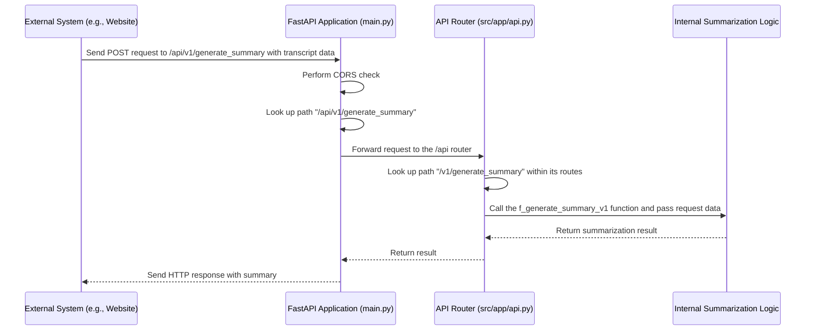

# Chapter 1: FastAPI Application

Welcome to the first chapter of our tutorial on the `7thgear-ai-service-mle` project! We're excited to guide you through how this service works.

Imagine our AI service is like a building that provides a specific service – in our case, summarizing meeting transcripts. For anyone outside the building to use this service, they need a way to enter, ask for what they need, and receive the result. This is where our first concept comes in: the **FastAPI Application**.

Think of the FastAPI Application as the main **reception desk** of our service building. It's the first point of contact for anyone outside. Its main job is to:

1.  **Listen** for incoming requests from external systems (like a user interface or another application).
2.  Perform basic **initial checks** (like making sure the request is allowed based on where it came from - more on this later).
3.  Figure out **what the request is asking for** (e.g., "Please summarize this transcript") and **where inside the building** (our service) that specific task is handled.
4.  **Direct** the request to the correct internal "department" or logic for processing.
5.  Receive the result back from the internal logic and **send it back** to the original requester.

In technical terms, the FastAPI Application is the core web server instance that defines the **API endpoints** that external systems interact with. An API endpoint is simply a specific address (like a URL path) that you can send requests to, asking the service to do something specific or give you some information.

Our central use case we'll keep in mind is: **How does an external system ask our service to summarize a meeting transcript?** The FastAPI Application is the critical first step in handling this request.

Let's dive into the code to see how this reception desk is set up.

### Setting up the Reception Desk (`main.py`)

The main file where our FastAPI application is defined is `main.py`. This file is responsible for creating the main application instance and setting up some basic configurations.

Here's a look at the core of `main.py`:

```python
# main.py (simplified)

from fastapi import FastAPI
from fastapi.middleware.cors import CORSMiddleware # For security checks

from src.app import router # Our internal API routes
from src.frontend_api import ui_router # Routes for a potential UI

# 1. Create the FastAPI application instance
app = FastAPI()

# 2. Configure basic security (CORS)
# This allows other websites/applications to talk to ours
allow_origins = ["*"] # In production, you'd list specific origins!
app.add_middleware(
    CORSMiddleware,
    allow_origins=allow_origins,
    allow_credentials=True,
    allow_methods=["*"],
    allow_headers=["*"],
)

# 3. Include our different sets of API endpoints
app.include_router(router, prefix="/api")
app.include_router(ui_router, prefix="/ui")

# 4. Define a simple endpoint for checking if the service is running
@app.get("/health")
async def health_check():
    """Health check endpoint"""
    return {"status": "healthy"}

# (Code to run the server is below this, but this is the setup)
```

Let's break this down:

*   `app = FastAPI()`: This line is like opening the reception desk for business! It creates the main application object that will handle everything.
*   `app.add_middleware(CORSMiddleware, ...)`: This sets up a basic security guard at the entrance. **CORS** (Cross-Origin Resource Sharing) is a standard web security feature. This middleware checks if the website or application trying to talk to our service is allowed to do so. Setting `allow_origins=["*"]` is like saying "anyone is allowed in" for development, but in a real-world service, you'd only allow specific, trusted origins.
*   `app.include_router(...)`: This is like telling the reception desk, "Okay, we have different departments in this building. Requests starting with `/api` should go to *this* set of internal routes (defined elsewhere), and requests starting with `/ui` should go to *that* set of internal routes." This helps organize our API endpoints. We'll look at the `/api` router (`src.app.router`) next.
*   `@app.get("/health")`: This defines a specific entrance point (an endpoint) at the address `/health`. When someone sends a GET request to `/health`, the `health_check()` function is called. This is a common way to check if the service is alive and running.

### Routing Requests to the Right Department (`src\app\api.py`)

While `main.py` sets up the main reception desk and includes general route categories (`/api`, `/ui`), the actual API endpoints for tasks like summarization are defined in other files, specifically `src\app\api.py` for the core `/api` endpoints.

Think of `APIRouter` as a section manager within our reception area. It groups related tasks together. `main.py` hands off requests starting with `/api` to this router manager.

Here's a simplified look at `src\app\api.py`:

```python
# src\app\api.py (simplified)

from fastapi import APIRouter, HTTPException, Request

# Import logic for generating summary (details in later chapters)
from src.agent.service import generate_summary as generate_summary_v1
from src.app.schema import QuerySummaryRequest, QuerySummaryResponse # Data formats

# Create a router instance for API endpoints
router = APIRouter()

# Define the endpoint for generating a summary from raw transcript
@router.post("/v1/generate_summary")
def f_generate_summary_v1(request: Request, query_request: QuerySummaryRequest):
    """Generate summary from raw transcript"""
    try:
        # 1. Receive the request data (query_request)
        # 2. Call the internal logic to process the request
        log_id, state_info, processed_response = generate_summary_v1(query_request)

        # 3. Format the response
        summary = {"log_id": log_id, "state_info": state_info}

        # 4. Return the response back to the user
        return QuerySummaryResponse(summary=summary, status=200)

    except Exception as e:
        # 5. Handle errors
        raise HTTPException(status_code=500, detail=str(e))
```

Let's break this down:

*   `router = APIRouter()`: This creates our section manager for the `/api` part of the service.
*   `@router.post("/v1/generate_summary")`: This defines a specific entrance within this `/api` section, specifically for requests using the `POST` method (typically used for sending data to create or update something) at the path `/v1/generate_summary`. This is one of the addresses external systems can use to request a summary.
*   `def f_generate_summary_v1(...)`: This is the function that runs when a request comes to `/api/v1/generate_summary`.
    *   `request: Request`: This parameter gives us access to details about the incoming request itself.
    *   `query_request: QuerySummaryRequest`: This is crucial! FastAPI automatically expects the incoming request body to contain data formatted according to the `QuerySummaryRequest` structure (which we'll learn about in the next chapter). FastAPI automatically handles parsing this data for us.
*   Inside the function, `generate_summary_v1(query_request)` is called. This is where the actual work of summarization happens. We'll explore this internal logic in much later chapters, particularly the [Agent Pipeline (LangGraph)](04_agent_pipeline__langgraph__.md).
*   `return QuerySummaryResponse(...)`: Once the internal logic provides a result, this line formats it into the `QuerySummaryResponse` structure and sends it back as the response to the external system.
*   `try...except HTTPException`: This is standard practice to catch any errors that happen during processing and return a proper HTTP error response (like a 500 Internal Server Error) to the external system, rather than crashing.

There are other endpoints defined in `src\app\api.py` for different tasks, like `/v1/generate_summary_s3` (summarizing from a file in S3) or `/v1/get_transcript` (retrieving a transcript), but they all follow the same pattern: an `@router` decorator defining the endpoint path and method, and a Python function that handles the request, calls internal logic, and returns a response.

### The Flow of a Request

So, how does a request for summarization actually travel through our FastAPI application? Here's a simple diagram illustrating the process:



1.  An **External System** sends a `POST` request to our service's address (e.g., `http://localhost:8000/api/v1/generate_summary`).
2.  The **FastAPI Application** (`main.py`) receives the request.
3.  It performs basic checks like CORS.
4.  It sees the request starts with `/api` and directs it to the `APIRouter` instance defined in `src\app\api.py`.
5.  The **API Router** receives the request and looks for a matching endpoint definition (a `@router.post`). It finds the one for `/v1/generate_summary`.
6.  The router calls the associated Python function (`f_generate_summary_v1`) and passes the request data to it (parsed into a `QuerySummaryRequest` object).
7.  This function then calls the **Internal Summarization Logic** (which involves other parts of the system we'll see later).
8.  The Internal Logic does the heavy lifting and returns the summary result back to the router function.
9.  The router function formats the result and returns it back through the FastAPI application.
10. The FastAPI Application sends the final HTTP response containing the summary back to the **External System**.

### Why use FastAPI?

FastAPI is chosen for this project because it's:

*   **Fast:** It's built on high-performance components.
*   **Easy to code:** It uses standard Python type hints, which makes the code clear and reduces bugs.
*   **Automatic Documentation:** It automatically generates interactive API documentation (using OpenAPI/Swagger UI), which is incredibly helpful for understanding and testing the API endpoints.

### Conclusion

In this chapter, we've introduced the FastAPI Application as the primary entry point and web server for our service. It acts like a reception desk, receiving external requests, performing initial checks (like CORS), and routing them to the correct internal handlers defined using `APIRouter`. We saw how `main.py` sets up the main application and includes routers, and how `src\app\api.py` defines specific endpoints like the one for generating summaries.

We briefly touched upon the structure of incoming data (`query_request: QuerySummaryRequest`) and outgoing data (`QuerySummaryResponse`), but we haven't looked at *what* these data structures actually look like in detail. That's exactly what we'll cover in the next chapter!

Let's move on to understand the structure of the information that flows in and out of these API endpoints in [Chapter 2: API Data Schemas](02_api_data_schemas_.md).

---

Generated by [AI Codebase Knowledge Builder](https://github.com/The-Pocket/Tutorial-Codebase-Knowledge)