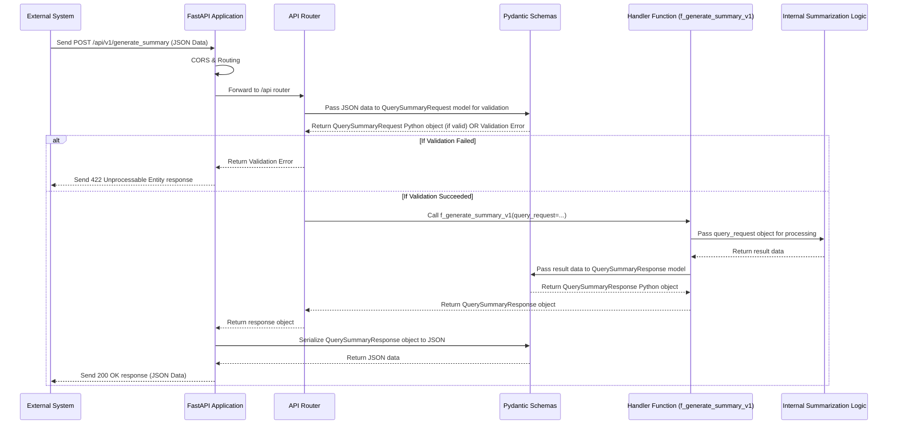

# Chapter 2: API Data Schemas

Welcome back! In [Chapter 1: FastAPI Application](01_fastapi_application_.md), we learned that our FastAPI application acts like the main reception desk for our AI service, handling incoming requests and routing them to the right place. But when a request arrives, how does the reception desk know exactly *what* information the external system is sending (like the meeting transcript itself, or details about which AI model to use)? And when the service responds, how does the external system know the *format* of the summary it will receive?

This is where **API Data Schemas** come in.

Think of data schemas as the **standardized forms** or **menus** used at our service's reception desk. When you want to request a summary, you need to fill out a specific *request form*. This form has designated spaces for the transcript text, your preferred AI model, and other necessary details. When the service is done, it gives you a result packaged neatly in a standard *response format*, maybe like a structured report that clearly labels the summary, any action items, etc.

Without these forms and formats (schemas), chaos would ensue! An external system might send the transcript in the wrong box, or our service might send back the summary in a jumbled mess.

In our `7thgear-ai-service-mle` project, we use a powerful Python library called **Pydantic** to define these data schemas. Pydantic models act as:

1.  **A Contract:** They clearly define the expected structure, field names, and data types for data exchanged via the API. It's like saying, "If you want a summary, your request *must* have a field named `raw_transcript` which *must* be text."
2.  **Validation:** When data arrives at our API, Pydantic automatically checks if it matches the defined schema. If something is missing, has the wrong type, or doesn't meet certain rules (like a URL being valid), Pydantic flags an error *before* the request even reaches our core logic. This prevents bad data from causing problems inside the service.
3.  **Serialization/Deserialization:** Pydantic helps convert incoming JSON data (the common format for web APIs) into Python objects we can easily work with, and convert Python objects back into JSON for the response.

Let's see how this works for our central use case: **requesting a summary of a meeting transcript**.

### Defining the Data Contract with Pydantic

All our API data schemas are defined in files within the `src\app\schema.py` and `src\frontend_api\schema.py` directories. For the core API endpoints we saw in Chapter 1, the definitions live in `src\app\schema.py`.

Let's look at the Pydantic models for our summarization endpoint: `QuerySummaryRequest` and `QuerySummaryResponse`.

#### The Request Schema: `QuerySummaryRequest`

This model defines the structure of the data an external system needs to send to the `/api/v1/generate_summary` endpoint.

```python
# src\app\schema.py (simplified QuerySummaryRequest)

from typing import Optional
from pydantic import BaseModel, field_validator # Import necessary parts

# Define sub-schemas for nested data
class InteractionMetadata(BaseModel):
    interaction_title: str
    interaction_description: Optional[str] = ""

class AttendeeMetadata(BaseModel):
    is_organizer: bool = False
    # ... other attendee fields ...

class QuerySummaryRequest(BaseModel):
    """Request schema for the generating summary endpoint"""

    raw_transcript: Optional[str] = None # The transcript text (optional)
    transcript_id: Optional[str] = None # An ID if the transcript is stored elsewhere
    model_type: str = "openai"       # Which AI provider to use (e.g., "openai", "bedrock")
    model_name_high: Optional[str] = "gpt-4o" # Name of the high-tier model
    # ... other model names, settings, flags ...
    account_id: str = ""             # Account identifier
    account_domain: str              # Account domain
    interaction_metadata: InteractionMetadata # Details about the meeting
    attendee_metadata: AttendeeMetadata # Details about the requester
    webhook_endpoint: Optional[str] = None # Where to send async results

    # Pydantic also allows validation and default setting logic
    @field_validator("model_type")
    @classmethod
    def validate_model_type(cls, v: str) -> str:
        allowed_types = ["openai", "bedrock", "gemini"]
        if v not in allowed_types:
            raise ValueError(f"model_type must be one of {allowed_types}")
        return v

    # ... other validators and default setters ...
```

**Explanation:**

*   `class QuerySummaryRequest(BaseModel):`: This line tells Pydantic we're defining a data model named `QuerySummaryRequest` that inherits from `BaseModel`.
*   `raw_transcript: Optional[str] = None`: This defines a field named `raw_transcript`.
    *   `: Optional[str]` means it's expected to be a string (`str`) but it can also be `None`.
    *   `= None` sets a default value. If the incoming data doesn't provide `raw_transcript`, it will be set to `None`.
*   `model_type: str = "openai"`: This defines a field `model_type` that *must* be a string (`str`). If not provided, it defaults to `"openai"`.
*   Notice how complex data like meeting details are also defined as their own `BaseModel` (`InteractionMetadata`, `AttendeeMetadata`) and then included as fields in the main request model. This helps organize the schema.
*   `@field_validator("model_type")`: This shows Pydantic's validation power. Even though `model_type` is a string, this code adds an extra check to ensure the string value is *only* one of the allowed types ("openai", "bedrock", "gemini"). If you send "google" as the `model_type`, Pydantic will automatically reject the request and send an error back *before* our main logic runs.

This `QuerySummaryRequest` acts as the blueprint for the JSON data expected in the body of the `POST` request to `/api/v1/generate_summary`.

#### The Response Schema: `QuerySummaryResponse`

This model defines the structure of the data the external system will receive back from the `/api/v1/generate_summary` endpoint.

```python
# src\app\schema.py (simplified QuerySummaryResponse)

from pydantic import BaseModel

class QuerySummaryResponse(BaseModel):
    """Response schema for the generating summary endpoint"""

    summary: dict  # The actual summary data (as a JSON object/Python dict)
    status: int  # An integer status code (like 200 for success)
    message: str = "Summary generated successfully." # A descriptive message
```

**Explanation:**

*   `class QuerySummaryResponse(BaseModel):`: Defines the response model.
*   `summary: dict`: Expects a field named `summary` which will contain the result. The type hint `dict` indicates it will be a Python dictionary, which translates directly to a JSON object in the API response. The *structure* of this summary dictionary (`summary: {}`) isn't strictly defined here, but Pydantic ensures it's *a* dictionary.
*   `status: int`: Expects an integer field named `status`.
*   `message: str = ...`: Expects a string field `message` with a default success message.

This `QuerySummaryResponse` ensures that no matter what happens inside our service, the external system will receive a response with at least a `summary` (even if empty), a `status` code, and a `message`.

### How FastAPI Uses Schemas

This is where Pydantic and FastAPI work together beautifully. Remember the function signature from Chapter 1?

```python
# src\app\api.py (snippet revisited)

from fastapi import APIRouter # ... other imports ...
from src.app.schema import QuerySummaryRequest, QuerySummaryResponse # <-- Import schemas!

router = APIRouter()

@router.post("/v1/generate_summary")
def f_generate_summary_v1(query_request: QuerySummaryRequest): # <-- Type hint here!
    """Generate summary from raw transcript"""
    # ... internal logic ...
    summary_data = {"log_id": "abc", "state_info": "processed"} # Example data
    return QuerySummaryResponse(summary=summary_data, status=200) # <-- Use schema for return!

    # ... error handling ...
```

**Explanation:**

1.  **Incoming Data:** By adding the type hint `query_request: QuerySummaryRequest` to the function parameter, we tell FastAPI: "Expect the body of the incoming POST request to be JSON data, and please parse and validate it using the `QuerySummaryRequest` Pydantic model. If it's valid, pass it to me as a Python object named `query_request`." FastAPI handles all the JSON parsing and validation automatically! If validation fails (e.g., `model_type` is invalid), FastAPI immediately sends back a `422 Unprocessable Entity` error with details, without even calling our `f_generate_summary_v1` function.
2.  **Outgoing Data:** When our function finishes and `return QuerySummaryResponse(...)` is executed, FastAPI sees that the returned object is an instance of the `QuerySummaryResponse` Pydantic model. It then automatically takes this Python object, converts it into a JSON format according to the model's structure, and sends it back as the HTTP response body.

This automatic handling by FastAPI based on Pydantic type hints is incredibly powerful. It reduces boilerplate code for data handling and validation significantly.

### Flow with Schemas

Let's update our request flow diagram to include the schema step:



This diagram highlights how Pydantic acts as a gatekeeper *after* the request arrives at the right endpoint handler (`APIRouter` -> `Pydantic`) and *before* the response is sent back (`Handler` -> `Pydantic`).

### Other Schemas

Our project defines schemas for other API endpoints as well, like `S3SummaryRequest` for requesting summaries from transcripts stored in S3, or schemas in `src\frontend_api\schema.py` for frontend-specific interactions (like requesting details about a meeting). They all follow the same pattern: Pydantic `BaseModel` classes defining the expected structure.

You might also notice schemas like `InteractionMetadata` or `AttendeeMetadata`. These are smaller `BaseModel`s used to structure related pieces of data within a larger request or response model. This keeps the schemas organized and reusable.

```python
# src\app\schema.py (snippet)

# Reusable schema for meeting details
class InteractionMetadata(BaseModel):
    interaction_title: str
    interaction_description: Optional[str] = ""

# Reusable schema for attendee details
class AttendeeMetadata(BaseModel):
    is_organizer: bool = False
    attendee_department: Optional[str] = ""
    attendee_designation: Optional[str] = ""

# These are then used in QuerySummaryRequest, S3SummaryRequest, etc.
```

This modularity is a key benefit of using Pydantic models.

### Conclusion

API Data Schemas, defined using Pydantic models in our project, are essential for defining the structure and types of data exchanged with our service's API endpoints. They act as a clear contract, provide automatic data validation, and simplify the handling of JSON data in FastAPI.

By using schemas like `QuerySummaryRequest` and `QuerySummaryResponse`, we ensure that requests for summarization provide the necessary information in the correct format and that the responses we send back are structured consistently, making our API predictable and easier to use for external systems.

Now that we understand how data enters and leaves our service through well-defined schemas, we can start looking at what happens *after* the data is validated. Often, the first step in processing a request involves interacting with *other* services, like calling out to an external AI model or fetching data from cloud storage. We'll explore this in the next chapter.

Let's move on to understand how our service interacts with the outside world beyond receiving initial API requests in [Chapter 3: External Service Integrations](03_external_service_integrations_.md).

---

Generated by [AI Codebase Knowledge Builder](https://github.com/The-Pocket/Tutorial-Codebase-Knowledge)