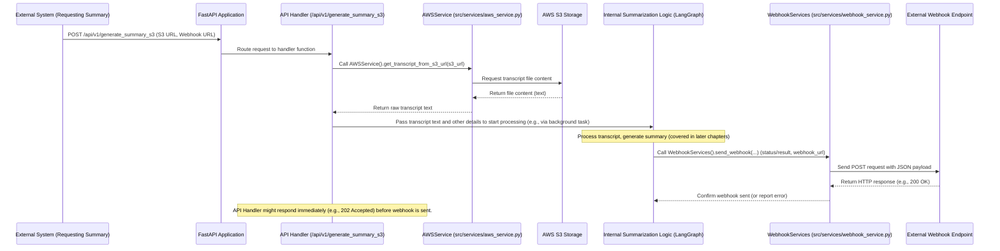

# Chapter 3: External Service Integrations

Welcome back! In the previous chapters, we set up our service's "reception desk" using [Chapter 1: FastAPI Application](01_fastapi_application_.md) and learned how we use [Chapter 2: API Data Schemas](02_api_data_schemas_.md) to define the standardized "forms" for requesting and receiving information.

Now that data arrives at the reception desk in the correct format, our service often needs to interact with systems *outside* of its own building before it can complete the request or send back the final result.

Imagine our service needs to summarize a transcript that isn't sent directly in the request, but is instead stored in a cloud storage service like Amazon S3. Our service needs a way to "go out" to S3, find the specific file, and bring its content back inside for processing. Similarly, once the summary is generated, the system that originally requested it might not be waiting on the line. Instead, it might ask our service to "call me back" at a specific address (a webhook) to deliver the result later.

This is where **External Service Integrations** come in.

These components act like specialized **delivery personnel** or **messengers** for our service. They handle all the complicated steps of talking to outside systems – whether it's fetching files from cloud storage or sending messages back via webhooks. By using these integrations, our core logic inside the service doesn't need to worry about the details of how to connect to S3, how to format an HTTP request for a webhook, or how to handle potential network issues. The integration components handle those complexities, providing a simple way for the rest of the service to interact with the outside world.

Our central use case involving external interactions is **requesting a summary of a transcript stored in an S3 bucket**. This requires fetching the transcript content *from* S3 and potentially sending a status update or the final summary *to* a webhook endpoint.

### Handling External Interactions

In our project, the code responsible for talking to these outside systems is typically found in the `src\services` directory. This directory is home to various "service" classes that encapsulate specific functionalities, including integrations with external platforms like AWS (for S3) or handling outgoing webhooks.

Let's look at the two main types of external interactions for our use case: fetching data from S3 and sending data via webhooks.

#### 1. Fetching Data from AWS S3

When a request comes in asking to summarize a transcript from an S3 URL (using the `/api/v1/generate_summary_s3` endpoint we briefly saw in Chapter 1), our service needs to get the actual text content of the file from S3. The `AWSService` class in `src\services\aws_service.py` handles this.

Think of `AWSService` as our dedicated **AWS S3 Retrieval Specialist**. You give it an S3 URL, and it figures out how to connect to AWS, navigate to the correct bucket and file, read the content, and hand you back the raw text.

Here's a simplified look at the key method for fetching transcript content:

```python
# src\services\aws_service.py (simplified)

import boto3 # The Python library for AWS
from fastapi import HTTPException
# ... other imports ...

class AWSService:
    # ... initialization and other methods ...

    def get_transcript_from_s3_url(self, s3_url):
        """Fetches transcript content from a given S3 URL."""
        try:
            s3 = boto3.client("s3") # Connect to S3

            # Helper to figure out bucket and key from the URL
            bucket, key = self._parse_s3_url(str(s3_url))

            # Get the object from S3
            obj = s3.get_object(Bucket=bucket, Key=key)

            # Read the content and decode it (assuming UTF-8 text)
            transcript_content = obj["Body"].read().decode("utf-8")

            # Check file size (basic validation)
            if obj["ContentLength"] > settings.MAX_FILE_SIZE:
                 raise Exception("File size exceeds max allowed!")

            return transcript_content # Return the text content

        except Exception as e:
            # Handle any errors and raise an HTTPException for FastAPI
            raise HTTPException(
                status_code=400, detail="Invalid S3 object url!"
            ) from e

    # _parse_s3_url method would be here
```

**Explanation:**

*   `import boto3`: This imports the standard Python library for interacting with AWS services.
*   `boto3.client("s3")`: This line establishes a connection to the AWS S3 service.
*   `self._parse_s3_url(str(s3_url))`: This calls an internal helper method (not shown completely here for simplicity) that takes the S3 URL string and extracts the necessary bucket name and file path (key).
*   `s3.get_object(Bucket=bucket, Key=key)`: This is the core command using the `boto3` library to retrieve the file object from S3.
*   `obj["Body"].read().decode("utf-8")`: This reads the binary content of the file and decodes it into a standard Python string, assuming it's text encoded in UTF-8.
*   `try...except HTTPException`: Standard error handling. If anything goes wrong (invalid URL, file not found, network error), it catches the error and raises a standard FastAPI `HTTPException` so the API endpoint can return a proper error response (like 400 Bad Request).

When our API handler function needs transcript text from S3, it simply calls `AWSService().get_transcript_from_s3_url(the_s3_url)`, and the `AWSService` instance takes care of all the communication with AWS S3.

#### 2. Sending Data via Webhooks

After processing a transcript (which happens in later parts of the system like the Agent Pipeline), our service often needs to inform the original requesting system about the result (success, failure, or provide the summary). If the request included a `webhook_endpoint` in the [Chapter 2: API Data Schemas](02_api_data_schemas_.md) (`S3SummaryRequest` includes this), our service will use this endpoint to send a notification. The `WebhookServices` class in `src\services\webhook_service.py` handles this.

Think of `WebhookServices` as our dedicated **Outgoing Messenger Service**. You give it the details of the message (job ID, status, summary data) and the address to send it to (the webhook URL), and it takes care of packaging the message correctly and sending it via HTTP.

Here's a simplified look at the key method for sending a webhook:

```python
# src\services\webhook_service.py (simplified)

import requests # The Python library for making HTTP requests
from typing import Any, Dict, Optional
# ... other imports ...

class WebhookServices:
    def __init__(self):
        # Load configuration details like base URL and auth token
        self.webhook_url = settings.WEBHOOK_URL # Default webhook URL
        self.auth_token = settings.WEBHOOK_AUTH_TOKEN # Authentication token

    def send_webhook(
        self,
        job_id: str,
        status: str,
        output_payload: dict,
        webhook_endpoint: Optional[str] = None, # Override default URL
    ) -> Dict[str, Any]:
        """Sends a webhook notification to the specified endpoint."""

        # Structure the payload data according to the expected format
        payload = {
            "job_id": job_id,
            "processed_by": "mlexperts",
            "status": status,
            "payload": output_payload, # The actual result data (e.g., summary)
            "regenerate": "False", # Example field
        }

        # Define necessary HTTP headers (like telling the receiver it's JSON)
        headers = {
            "Accept": "*/*",
            "Authorization": self.auth_token, # Include auth token
            "Content-Type": "application/json",
        }

        # Use the provided endpoint if available, otherwise use the default
        target_endpoint = webhook_endpoint if webhook_endpoint else self.webhook_url

        logger.info(f"Sending webhook for job {job_id} to {target_endpoint}") # Log the action

        # Use the 'requests' library to send a POST request
        response = requests.post(
            target_endpoint, # The URL to send to
            json=payload,    # The data to send (will be converted to JSON)
            headers=headers, # The headers to include
            timeout=15       # Don't wait forever for a response
        )

        # Check if the request was successful (status code 2xx)
        response.raise_for_status() # Will raise an exception for bad status codes (4xx or 5xx)

        return response.json() # Return the response from the webhook receiver
```

**Explanation:**

*   `import requests`: This imports the popular Python library used for making HTTP requests.
*   `__init__`: This method runs when you create a `WebhookServices` object and loads configuration like the default webhook URL and an authorization token (important for security).
*   `payload = {...}`: This dictionary defines the structure of the data that will be sent in the body of the HTTP request to the webhook endpoint. It includes identifying information (`job_id`, `status`) and the actual result data (`output_payload`).
*   `headers = {...}`: This dictionary defines the HTTP headers that will be included in the request. `Content-Type: application/json` tells the receiving system that the body is in JSON format. `Authorization` is used to include a token to verify the request's origin.
*   `requests.post(...)`: This is the core command using the `requests` library to send an HTTP POST request. It takes the target URL, the payload (automatically converted to JSON because we use the `json` parameter), the headers, and a timeout value.
*   `response.raise_for_status()`: This is a convenient method from the `requests` library that checks the HTTP status code of the response received from the webhook endpoint. If it's an error code (like 404 Not Found or 500 Internal Server Error), it raises an exception, allowing our service to know that the webhook delivery failed.

When our internal processing logic finishes a task and needs to report the result via webhook, it simply calls `WebhookServices().send_webhook(...)`, and the `WebhookServices` instance handles the communication with the external webhook endpoint.

### How External Service Integrations Fit into the Flow

Let's revisit our request flow, specifically for the `/api/v1/generate_summary_s3` endpoint, and see where these integration services are used.



This diagram shows:

1.  The **External System** sends a request with an S3 URL and a potential webhook URL to our **FastAPI Application**.
2.  The **API Handler** function receives the request data (validated by [Chapter 2: API Data Schemas](02_api_data_schemas_.md)).
3.  The **API Handler** calls the **AWSService** instance, passing the S3 URL.
4.  The **AWSService** talks directly to **AWS S3** to retrieve the transcript content.
5.  The raw transcript text is returned from **AWSService** back to the **API Handler**.
6.  The **API Handler** then passes this raw transcript text (along with other request details) to the **Internal Summarization Logic** to begin processing (often done in a background task so the API can respond quickly, as seen in `generate_summary_from_s3_service`).
7.  Once the **Internal Logic** is finished, it calls the **WebhookServices** instance, providing the job details, the final status, and the result data, plus the webhook URL from the original request.
8.  The **WebhookServices** instance sends an HTTP request to the **External Webhook Endpoint**.
9.  The **External Webhook Endpoint** responds to the webhook call.

This clearly illustrates how `AWSService` handles the "getting input from outside" part and `WebhookServices` handles the "sending output to outside" part, keeping the central API handler and the internal processing logic cleaner.

Let's see a snippet from `src\services\generate_summary_services.py` which acts as an intermediary orchestrator, showing how it uses `AWSService`:

```python
# src\services\generate_summary_services.py (simplified)

from fastapi import BackgroundTasks # To run processing without blocking the API response
from loguru import logger

# Import our data schemas
from src.app.schema import QuerySummaryRequest, S3SummaryRequest

# Import the AWS Service
from src.services.aws_service import AWSService

# Import the actual agent processing logic (more in Chapter 4)
from src.agent.service import generate_summary_s3_agent_service

def generate_summary_from_s3_service(
    raw_query_request: S3SummaryRequest, # Input request validated by Schema
    db, # Database dependency (more in Chapter 8)
    background_tasks: BackgroundTasks, # FastAPI helper for background tasks
):
    # Use AWSService to get the transcript content
    raw_transcript = AWSService().get_transcript_from_s3_url(
        raw_query_request.s3_object_url # Pass the S3 URL from the request
    )

    logger.info(f"Fetched transcript from S3 and ready to process job: {raw_query_request.job_id}")

    # Create the internal QuerySummaryRequest schema object
    # This prepares the data in the format needed by the main processing logic
    query_request = QuerySummaryRequest(
        raw_transcript=raw_transcript, # Use the fetched transcript content
        # ... populate other fields from raw_query_request ...
        transcript_id=raw_query_request.job_id,
        webhook_endpoint=raw_query_request.webhook_endpoint, # Pass webhook URL along
    )

    # ... Database logic skipped for simplicity ...

    # Add the main processing task to the background
    background_tasks.add_task(
        generate_summary_s3_agent_service, # The function that does the actual summarization
        db,
        query_request, # Pass the prepared request object
        job_id=raw_query_request.job_id,
        webhook_endpoint=raw_request.webhook_endpoint, # Pass webhook URL for later use
    )

    # Return a response indicating the job has started (as it's in a background task)
    summary = {
        "job_id": raw_query_request.job_id,
        "status": "accepted", # Or INPROGRESS based on initial DB state
    }

    return summary
```

**Explanation:**

*   This function is likely called by a FastAPI endpoint handler (like one for `/api/v1/generate_summary_s3`).
*   It receives `raw_query_request`, which is a `S3SummaryRequest` Pydantic model instance (thank you, [Chapter 2: API Data Schemas](02_api_data_schemas_.md)!).
*   `raw_transcript = AWSService().get_transcript_from_s3_url(...)`: This line is key! It instantiates `AWSService` and calls the method to fetch the transcript content using the S3 URL provided in the request. The actual text content is stored in `raw_transcript`.
*   A new `QuerySummaryRequest` object is created, which is the standard format expected by the main summarization logic. The `raw_transcript` that was just fetched is placed into this object.
*   `background_tasks.add_task(...)`: The actual heavy lifting of summarization is added as a background task. The `generate_summary_s3_agent_service` function (part of the [Chapter 4: Agent Pipeline (LangGraph)](04_agent_pipeline__langgraph__.md)) will receive the prepared `query_request` object containing the fetched transcript text.
*   The `webhook_endpoint` from the original request is also passed along, so the background task knows where to send the result notification later using the `WebhookServices`.
*   The function returns a simple status indicating that the request was accepted and processing has started, allowing the original API call to finish quickly.

This example shows how the `generate_summary_from_s3_service` acts as an orchestrator, using `AWSService` to get input data before handing it off to the processing pipeline. The processing pipeline itself (covered in Chapter 4) will then use `WebhookServices` to send the output notification.

### Why Abstract External Services?

Using separate classes like `AWSService` and `WebhookServices` provides significant benefits:

*   **Separation of Concerns:** Code for talking to AWS S3 is separate from code for sending webhooks, and both are separate from the core summarization logic. This makes each part easier to understand, develop, and test.
*   **Maintainability:** If AWS changes its S3 API, we only need to update `AWSService`. If we switch to a different cloud provider like Google Cloud Storage, we can create a new `GCPStorageService` with the same methods (`get_transcript_from_url`), and the rest of the code that *uses* this service doesn't need to change.
*   **Testability:** We can easily test `AWSService` or `WebhookServices` in isolation, without needing a real AWS account or a live webhook endpoint. We can also create "mock" versions of these services for testing the code that *uses* them.
*   **Readability:** The code that orchestrates the process (like `generate_summary_from_s3_service`) is much cleaner because it just calls methods like `get_transcript_from_s3_url` and `send_webhook` without seeing the underlying complexity of network requests, authentication, etc.

These external service integration components are crucial for connecting our AI service to the wider ecosystem of systems it needs to interact with.

### Conclusion

In this chapter, we explored the concept of External Service Integrations. We learned how components like `AWSService` and `WebhookServices` in the `src\services` directory act as specialized messengers, handling the complexities of fetching data from outside systems (like cloud storage) and sending results or notifications back (like via webhooks).

By abstracting these external interactions, we keep our core application logic focused on its primary job – summarization – making the codebase cleaner, more maintainable, and easier to test.

Now that we understand how data comes into our system and how we fetch external data like transcripts, we are ready to dive into the heart of the service: the intelligent pipeline that processes this data and generates the summary.

Let's move on to explore the sophisticated processing logic built using LangGraph in [Chapter 4: Agent Pipeline (LangGraph)](04_agent_pipeline__langgraph__.md).

---

Generated by [AI Codebase Knowledge Builder](https://github.com/The-Pocket/Tutorial-Codebase-Knowledge)