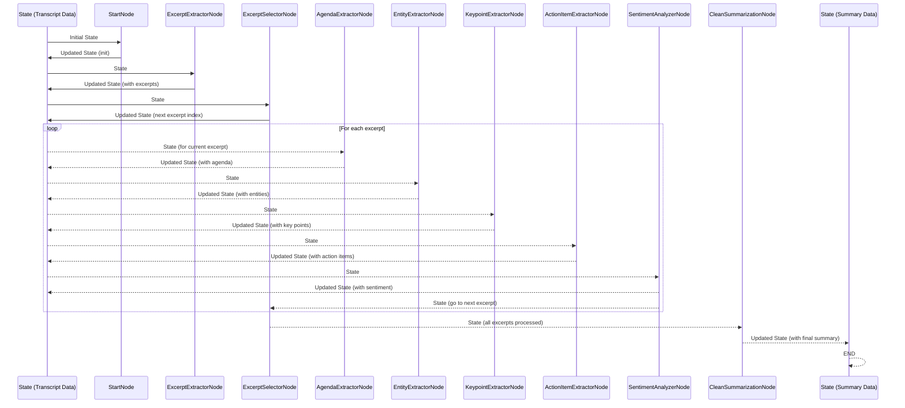

# Chapter 4: Agent Pipeline (LangGraph)

Welcome back! In [Chapter 3: External Service Integrations](03_external_service_integrations_.md), we learned how our service fetches necessary data, like a meeting transcript from S3, and how it can send out notifications via webhooks. Now that we have the raw transcript text inside our system, how do we actually *process* it? How do we take that long block of text and transform it step-by-step into a structured summary, extracting key points, action items, sentiment, and more?

Processing a transcript is not one simple step; it's a sequence of tasks. We might need to identify the main topics, then for each topic, extract entities, then key points, then action items, and finally analyze the sentiment. Sometimes, the result of one step might change what we need to do next. This is where things can get complicated if we just write a long list of function calls.

Imagine again our service building. We've received the package (the transcript) at the reception desk ([Chapter 1: FastAPI Application](01_fastapi_application_.md)) with the right forms ([Chapter 2: API Data Schemas](02_api_data_schemas_.md)), and fetched any external parts like the transcript file itself ([Chapter 3: External Service Integrations](03_external_service_integrations_.md)). Now, the package needs to go through several specialized departments for processing.

This complex workflow, where the output of one step becomes the input for the next, and where decisions might be made along the way ("If the transcript is about a sales call, send it to the Sales Analysis department; otherwise, send it to General Meeting processing"), is managed by the **Agent Pipeline**, built using a library called **LangGraph**.

Think of the Agent Pipeline as the sophisticated **automated assembly line** within our service building. It defines all the specific workstations (departments/tasks) and the conveyor belts (rules) that move the transcript and its accumulating results from one workstation to the next until the final summary product is complete. LangGraph is the engine that powers this assembly line.

Its main jobs are:

1.  **Define the steps:** Clearly lay out all the individual tasks needed (like "Extract Key Points"). These are called **Nodes**.
2.  **Define the flow:** Specify the paths (called **Edges**) that connect the Nodes, determining the sequence of tasks.
3.  **Manage the data:** Keep track of the transcript and all the results generated at each step. This central bundle of information is called the **State**.
4.  **Make decisions:** Allow the pipeline to choose different paths based on the current State (Conditional Edges).
5.  **Resume work:** If the pipeline is interrupted, it can save its progress (the State) and pick up exactly where it left off.

Our central use case - **generating a structured summary from a raw transcript** - is processed entirely by this Agent Pipeline. The API endpoint and external services get the data ready, but the pipeline does the heavy lifting of transforming that data.

Let's explore the key concepts of this LangGraph pipeline.

### Key Concepts of LangGraph

LangGraph helps build stateful, multi-actor applications. For our summarization task, this means:

#### 1. The State

The most crucial concept is the **State**. Imagine a clipboard or a box that travels along the assembly line. This box contains the original transcript and *all* the information generated or updated by each worker (Node).

In our project, the State is represented by a Python dictionary-like object, defined in [Chapter 5: Agent State](05_agent_state_.md). Each Node in the pipeline receives this State, reads the information it needs from it, performs its task (like extracting action items), and then updates the State with its results before passing it along.

Example: A Node that extracts key points reads the `raw_transcript` from the State and adds a new list of `key_points` to the State.

#### 2. Nodes

Nodes are the individual, distinct steps or workers on our assembly line. Each Node is responsible for *one* specific task in the summarization process.

Examples of Nodes in our pipeline (as seen in `src/agent/nodes.py`):
*   `ExcerptExtractorNode`: Divides the long transcript into smaller sections (excerpts).
*   `KeypointExtractorNode`: Finds the most important points in a specific excerpt.
*   `ActionItemExtractorNode`: Identifies tasks or action items within an excerpt.
*   `SentimentAnalyzerNode`: Determines the overall feeling or sentiment in a part of the transcript.

Each Node is implemented as a Python function (or occasionally a class with a `run` method) that takes the current `State` as input and returns the updated `State`.

```python
# src/agent/nodes.py (simplified snippet)

from loguru import logger
# Import our State definition (more in Chapter 5)
from src.agent.states import SummarizerState
# Import the actual logic for generating key points (more in Chapter 7)
from src.key_points_extractor.main import generate_key_points

# Decorator for error handling (details not important for concept)
from src.core.decoraters import handle_exceptions

@handle_exceptions # This wraps the function to catch errors nicely
def KeypointExtractorNode(state: SummarizerState):
    """Key points extractor node"""
    logger.info("Running KeypointExtractorNode...")

    # 1. Read necessary info from the current state
    excerpt = state["excerpts"][state["excerpt_idx"]].get("excerpt_text")
    agenda = state["agenda"]
    model_name = state["model_name_high"]
    # ... other model details from state ...

    # 2. Call the actual logic to do the work (details in Chapter 7)
    key_points_result, _, _ = generate_key_points(
        agenda=agenda,
        excerpt=excerpt,
        model_name=model_name,
        model_type=state["model_type"],
        temperature=state["temperature"],
        state=state, # Pass state for context/logging
    )

    # 3. Update the state with the result
    # Assuming key_points_result is like {'key_points': [...]}
    state["key_points"] = key_points_result.get("key_points", [])

    # Update the specific section in the summary structure within state
    for section in state["agendas_summary"]["sections"]:
        if section["agenda_name"] == agenda:
            section["key_points"] = state["key_points"]
            break

    # 4. Return the updated state
    return state

```

This simplified node function shows the pattern: grab data from `state`, do some work (often by calling another module, like `generate_key_points` which uses an LLM - more on that in [Chapter 7: LLM Processing Modules](07_llm_processing_modules_.md)), update `state`, and return `state`.

#### 3. Edges

Edges define how the process moves from one Node to the next. After a Node finishes its work and returns the updated State, LangGraph looks at the Edges connected to that Node to decide where to send the State next.

There are two types of edges:

*   **Direct Edges:** Always send the State to the same next Node. This is like a standard conveyor belt always moving packages from station A to station B.
*   **Conditional Edges:** Send the State to different possible next Nodes based on the result of a special function called a "node selector" (or "router" or "conditional edge"). This is like a switch on the conveyor belt that inspects the package (the State) and sends it down one path or another.

```python
# src/agent/graph.py (snippet showing edges)

# ... graph definition and node additions ...

# Direct edge: Always go from START to "start" node
summarizer_graph.add_edge(START, "start")

# Direct edge: Always go from "start" node to "interaction_identification" node
summarizer_graph.add_edge("start", "interaction_identification")

# Direct edge: Always go from "clean_summarization" to "last_node"
summarizer_graph.add_edge("clean_summarization", "last_node")

# Conditional edge: After "excerpt_extractor", call select_next_node_after_excerpt_extractor
# This function will return *one* of the specified nodes ("excerpt_selector" or "last_node")
summarizer_graph.add_conditional_edges(
    "excerpt_extractor",
    select_next_node_after_excerpt_extractor,
    ["excerpt_selector", "last_node"], # The possible next nodes
)

# Conditional edge: After "excerpt_selector", call select_next_node_after_excerpt_selector
# This function will return "agenda_extractor", "clean_summarization", or "last_node"
summarizer_graph.add_conditional_edges(
    "excerpt_selector",
    select_next_node_after_excerpt_selector,
    ["agenda_extractor", "clean_summarization", "last_node"], # The possible next nodes
)

# ... more edges ...

# Define the end point
summarizer_graph.add_edge("last_node", END)

# ... compile the graph ...
```

#### 4. Node Selectors (Conditional Edges)

These are the "decision-makers" for conditional edges. A node selector is a small function that looks at the current `State` and decides which Node should run next. It simply returns the *name* of the next Node as a string.

```python
# src/agent/node_selector.py (simplified snippet)

# Import our State definition (more in Chapter 5)
from src.agent.states import SummarizerState
# Decorator for error handling (details not important)
from src.core.decoraters import wrap_state_transition


@wrap_state_transition # Wraps the function
def select_next_node_after_excerpt_selector(state: SummarizerState):
    """Select next node after excerpt selector"""
    # Check if all excerpts have been processed
    excerpts_len = len(state["excerpts"])
    current_excerpt_idx = state["excerpt_idx"]

    if current_excerpt_idx >= excerpts_len - 1:
        # If we processed the last excerpt, go to the final cleaning step
        return "clean_summarization"
    else:
        # If there are more excerpts, move to the AgendaExtractorNode for the next excerpt
        return "agenda_extractor"

```

This selector function checks if the pipeline has finished processing all the `excerpts` stored in the `state`. If yes, it routes the process to `"clean_summarization"`. If no, it routes to `"agenda_extractor"` to process the next excerpt.

#### 5. The Graph

The Graph is the overall blueprint created by combining the Nodes and the Edges. It defines the entire possible flow of the assembly line from start to finish. You use `StateGraph` to build this blueprint.

```python
# src/agent/graph.py (simplified snippet)

from langgraph.graph import END, START, StateGraph
# Import our State definition (more in Chapter 5)
from src.agent.states import SummarizerState
# Import our nodes and selectors
from src.agent.nodes import *
from src.agent.node_selector import *
# Import checkpointer (more below and in Chapter 8)
from langgraph.checkpoint.memory import MemorySaver # Or PostgresSaver

def create_state_graph():
    """Create graph for the state machine."""
    # 1. Initialize the graph with our state definition
    summarizer_graph = StateGraph(SummarizerState)

    # 2. Add all the nodes (workers) to the graph
    summarizer_graph.add_node("start", StartNode)
    summarizer_graph.add_node("interaction_identification", InteractionIdentificationNode)
    summarizer_graph.add_node("excerpt_extractor", ExcerptExtractorNode)
    # ... add all other nodes ...
    summarizer_graph.add_node("clean_summarization", CleanSummarizationNode)
    summarizer_graph.add_node("last_node", LastNode)

    # 3. Add edges (conveyor belts) connecting the nodes
    summarizer_graph.add_edge(START, "start") # Start here
    summarizer_graph.add_edge("start", "interaction_identification")
    # ... add direct edges ...
    summarizer_graph.add_edge("clean_summarization", "last_node")

    # 4. Add conditional edges (switches)
    summarizer_graph.add_conditional_edges(
        "excerpt_extractor",
        select_next_node_after_excerpt_extractor,
        ["excerpt_selector", "last_node"],
    )
    # ... add other conditional edges ...

    # 5. Define the end point
    summarizer_graph.add_edge("last_node", END) # Finish here

    # 6. Add checkpointer (for saving state)
    # More about this below and in Chapter 8
    checkpointer = MemorySaver() # Or configure PostgresSaver

    # 7. Compile the graph
    graph = summarizer_graph.compile(checkpointer=checkpointer)
    return graph

```
This function builds the entire flow chart of our summarization process.

#### 6. Checkpointers

LangGraph pipelines can be long-running processes. A checkpointer is like a system that periodically takes a snapshot of the State and saves it. If the process is interrupted (e.g., server restarts), the checkpointer allows the pipeline to reload the last saved State and continue from where it left off, instead of starting over.

Our project is configured to potentially use a database (Postgres) as a checkpointer, allowing persistent storage of the State. This is tied to the Database Layer ([Chapter 8: Database Layer](08_database_layer_.md)).

```python
# src/agent/graph.py (snippet for checkpointer)

from langgraph.checkpoint.memory import MemorySaver
from langgraph.checkpoint.postgres import PostgresSaver
from psycopg import connect, OperationalError # For database connection

# ... graph definition ...

try:
    # Try to connect to the database for persistent checkpointing
    conn = connect(DATABASE_URL, autocommit=True, prepare_threshold=0)
    checkpointer = PostgresSaver(conn)
    checkpointer.setup() # Set up the database tables if needed
    logger.info("Using PostgresSaver for state checkpointing.")
except OperationalError as e:
    # If database connection fails, fall back to in-memory checkpointing
    logger.warning(f"Postgres connection failed, falling back to MemorySaver: {e}")
    checkpointer = MemorySaver()
except Exception as e:
    # Catch other potential errors
    logger.error(f"Skipping PostgresSaver: {e}")

# Compile the graph with the chosen checkpointer
graph = summarizer_graph.compile(checkpointer=checkpointer)
```
This snippet shows how the graph is compiled with a checkpointer. If the database is available, it uses `PostgresSaver`; otherwise, it uses `MemorySaver` (which is non-persistent and only works for the life of the application instance).

### How the Agent Pipeline Processes a Request

Let's follow the journey of a raw transcript through the LangGraph pipeline using the `generate_summary_s3_agent_service` function we saw in [Chapter 3: External Service Integrations](03_external_service_integrations_.md).

1.  **Request Arrives:** An external system requests a summary from an S3 URL via the API.
2.  **API Handler & Service Orchestrator:** The FastAPI endpoint handler receives the request, validates it ([Chapter 2: API Data Schemas](02_api_data_schemas_.md)), and calls `generate_summary_from_s3_service`. This service uses `AWSService` ([Chapter 3: External Service Integrations](03_external_service_integrations_.md)) to fetch the transcript text.
3.  **Initialize State:** The service creates the initial `SummarizerState` object, populating it with the fetched `raw_transcript` and other details from the request (like `model_type`, `webhook_endpoint`, `job_id`).
4.  **Start the Graph:** The service calls `graph.stream(state, config=...)` to start running the LangGraph pipeline. The `config` includes a unique `thread_id` which the checkpointer uses to save and load the state for this specific processing job.
5.  **Process through Nodes and Edges:** LangGraph takes the initial State and feeds it to the first Node (`START` -> `"start"` -> `"interaction_identification"`). Each Node processes the State, updates it, and returns it. LangGraph then uses the Edges (direct or conditional via selectors) to determine the next Node.
6.  **Looping:** Notice in the code structure and the node selectors how the pipeline might loop back. For example, after processing an excerpt's sentiment (`SentimentAnalyzerNode`), the `select_next_node_after_sentiment_analyzer` selector sends the State back to the `ExcerptSelectorNode` to pick the *next* excerpt. This loop continues until `ExcerptSelectorNode` detects all excerpts are processed and routes to `clean_summarization`.
7.  **Saving State:** Periodically (or between node calls, depending on configuration), the checkpointer saves the current State using the `thread_id`.
8.  **Final Node:** The State eventually reaches the `clean_summarization` node, which gathers all the results collected during the excerpt processing loop and formats the final summary. It then moves to the `last_node` and finally to `END`.
9.  **Graph Finishes:** The `graph.stream` call finishes when the `END` node is reached. The final State, containing the complete `cleaned_summary`, is available.
10. **Build Response & Notify:** The service takes the final State, uses a helper (`build_response`) to format the output, updates the database record for the job ([Chapter 8: Database Layer](08_database_layer_.md)), and finally uses `WebhookServices` ([Chapter 3: External Service Integrations](03_external_service_integrations_.md)) to send the summary to the original requester's webhook endpoint.

Here's a simplified flow of the pipeline's journey, focusing on the core loop:



This diagram illustrates the core flow: extracting excerpts, then entering a loop to process each excerpt individually through several specialized nodes, and finally gathering everything for the final summary. The `State` is the central item being modified and passed along.

### Running the Graph

The process of executing the graph is simple from the perspective of the service function:

```python
# src/agent/service.py (simplified snippet from generate_summary_s3_agent_service)

# Graph object is created once when the module is imported
graph = create_state_graph()

def generate_summary_s3_agent_service(...):
    # ... create initial state ...

    # Define config including thread_id for checkpointer
    config = {
        "configurable": {"thread_id": thread_id},
        "recursion_limit": 2000, # Prevent infinite loops from crashing
    }

    # Run the graph! This loops through nodes based on edges until END is reached.
    # stream_mode="values" yields the full state after each step
    for event in graph.stream(state, config=config, stream_mode="values"):
        # You could potentially inspect the state after each step here if needed
        print(f"Processing step...")
        pass # We often don't need to do anything in the loop itself

    # After the loop finishes, get the final state
    state_info = graph.get_state(config).values

    # ... use state_info to build response, save to DB, send webhook ...
```

This snippet shows that once the graph is defined and the initial State is prepared, running the pipeline is primarily done by calling `graph.stream` or `graph.invoke`. For potentially long-running or interruptible processes like this summarization, `stream` is often preferred as it can yield intermediate results or states.

### Why Use LangGraph?

Using LangGraph provides several key benefits for this project:

*   **Structured Workflow:** It forces a clear definition of steps (Nodes) and flow (Edges), making the complex summarization logic easier to understand and visualize compared to a long procedural script.
*   **Modularity:** Each Node is an independent unit responsible for a single task. This makes the code cleaner, easier to test individually, and allows for easier swapping or updating of specific processing steps.
*   **State Management:** LangGraph provides a built-in, consistent way to manage the data (`State`) that flows through the pipeline.
*   **Flexibility:** Conditional edges allow for dynamic workflows that can adapt based on the data being processed (e.g., tailoring summarization based on transcript content or user preferences).
*   **Resilience:** With a checkpointer, the pipeline can recover from failures and resume processing without losing all progress (important for long tasks).
*   **Observability:** It's easier to see which step the process is currently in and inspect the State at different points.

The Agent Pipeline using LangGraph is truly the engine room of our service, orchestrating the entire process of turning raw transcript data into a valuable structured summary.

### Conclusion

In this chapter, we explored the Agent Pipeline, the core workflow engine of our service, built using LangGraph. We learned that it acts like an automated assembly line, processing the transcript and intermediate results through a sequence of steps called Nodes. We saw how Edges define the flow between these Nodes, sometimes conditionally based on the central State, which holds all the accumulating information. We also touched upon Checkpointers for saving the State and resuming work.

Understanding the Agent Pipeline requires a good grasp of the information it processes. In the next chapter, we'll take a closer look at the structure of that central piece of data – the State itself – and how it's designed to hold all the details needed throughout the pipeline.

Let's move on to understand the blueprint of the data flowing through our pipeline in [Chapter 5: Agent State](05_agent_state_.md).

---

Generated by [AI Codebase Knowledge Builder](https://github.com/The-Pocket/Tutorial-Codebase-Knowledge)