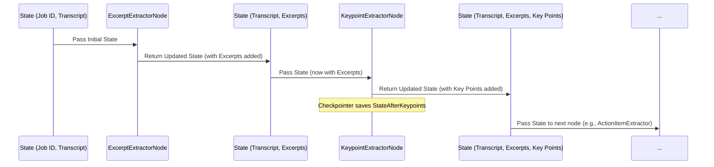

# Chapter 5: Agent State

Welcome back! In our journey through the `7thgear-ai-service-mle` project, we've seen how the [Chapter 1: FastAPI Application](01_fastapi_application_.md) receives requests, how [Chapter 2: API Data Schemas](02_api_data_schemas_.md) define the format of that data, and how [Chapter 3: External Service Integrations](03_external_service_integrations_.md) help us get data from or send data to outside systems like S3 or webhooks. Most recently, in [Chapter 4: Agent Pipeline (LangGraph)](04_agent_pipeline__langgraph__.md), we were introduced to the sophisticated automated assembly line that processes this data step-by-step.

But what exactly is moving *along* that assembly line? As the process goes from extracting excerpts to identifying entities to generating key points, where is all this information stored? How does each step know what the previous steps did?

This is the role of the **Agent State**.

Imagine the Agent Pipeline as a factory assembly line. The Agent State is like a **specialized backpack or clipboard** that travels with each item (in our case, a single summarization job) down the line. This backpack contains everything needed for that specific job:

*   The original instructions (like configuration settings and the raw transcript).
*   Space to add new information as it's generated (like the extracted excerpts, key points, action items, etc.).
*   A place to note down any issues or errors encountered along the way.

Every "worker" (Node) on the assembly line receives this backpack, looks inside to find the information it needs to do its job, performs its task, puts its results *back into* the backpack, and then sends the backpack along to the next worker.

The Agent State is the **single source of truth** for a particular summarization job as it progresses through the entire pipeline. It ensures that all parts of the system working on the same job are looking at the same, most up-to-date set of information.

Our central use case, **generating a structured summary from a raw transcript**, relies completely on the Agent State to carry the transcript data and accumulate the summary results through the various processing steps in the LangGraph pipeline.

### What is the Agent State in Our Project?

In our `7thgear-ai-service-mle` project, the Agent State is defined as a Python object that holds all the relevant data for one summarization job. LangGraph pipelines are built around a concept of a "state," and in our case, this state is specifically defined using a `TypedDict` called `SummarizerState`.

You can find its definition in `src/agent/states.py`.

```python
# src\agent\states.py (simplified)

import operator
from typing import Annotated, Any, Dict, List
from typing_extensions import TypedDict

class SummarizerState(TypedDict):
    """The state of the summarizer."""

    # Input data & Job identifiers
    log_id: str         # Unique ID for the job
    transcript_id: str  # ID related to the transcript source
    raw_transcript: str # The full text transcript

    # Configuration settings
    model_type: str     # e.g., "openai", "bedrock"
    model_name_high: str # e.g., "gpt-4o"
    temperature: float  # LLM creativity setting
    # ... other model names, flags, thresholds ...

    # Intermediate results (collected by nodes)
    excerpts: list[str]    # Smaller chunks of the transcript
    excerpt_idx: int       # Index of the excerpt currently being processed
    agenda: str            # Current topic/agenda being processed
    key_points: list       # Key points extracted for the current agenda/excerpt
    action_items: list     # Action items extracted for the current agenda/excerpt
    # ... other intermediate results like entities, sentiment ...

    # Final result structure (built up over time)
    agendas_summary: Any   # Structure holding results per agenda
    cleaned_summary: Any   # The final formatted summary

    # Error handling
    errors: Annotated[list, operator.add] # List to collect errors

    # Metadata from request
    interaction_title: str
    account_domain: str
    # ... other metadata fields from the API schema ...

    # Playbook configuration
    playbook: Dict # Rules/settings for this specific job type

    # Data collected for monitoring/debugging
    tokens_metadata: list
    response_time: list

```

**Explanation:**

*   `class SummarizerState(TypedDict):`: This defines a special type of dictionary. LangGraph's `StateGraph` works well with `TypedDict` because it expects the state to behave like a dictionary (allowing `state['key'] = value`), but `TypedDict` adds type hints, making it clearer what keys are expected and what their data types should be.
*   **Fields:** Each line within the class definition (e.g., `raw_transcript: str`) defines a piece of information that lives in the State backpack.
    *   `raw_transcript: str`: This tells us the state *must* have a key named `raw_transcript` and its value should be a string (holding the transcript text).
    *   `excerpts: list[str]`: This key will hold a list where each item is a string (representing a transcript excerpt).
    *   `agendas_summary: Any`: This key will hold the structure for the summary results, defined as `Any` here because its exact structure might be flexible or nested.
    *   `errors: Annotated[list, operator.add]`: This is a LangGraph-specific pattern. It means `errors` is a list, and when a node updates the state with `state["errors"].append(new_error)`, LangGraph's state merging (how it combines the old state with the node's returned state) should *append* items to the list using `operator.add` rather than replacing the whole list. This is how nodes can safely add their own errors without overwriting errors from previous nodes.

Essentially, `SummarizerState` is the blueprint for the backpack. It lists all the compartments and what type of information each compartment is meant to hold.

### How the Pipeline Uses the State

Let's see how the State is used throughout the Agent Pipeline (which we discussed in [Chapter 4: Agent Pipeline (LangGraph)](04_agent_pipeline__langgraph__.md)).

1.  **Initialization:** When a new summarization job starts (triggered by an API request), the first step is to create an initial instance of the `SummarizerState`. This involves taking the data received from the API request (like the `raw_transcript`, `model_type`, `job_id`, etc.) and putting it into the appropriate fields of a new `SummarizerState` dictionary.

    ```python
    # src/agent/service.py (simplified snippet)

    from src.agent.states import SummarizerState # Import the State definition
    # ... other imports ...

    def generate_summary_s3_agent_service(...):
        # ... fetch raw_transcript from S3 ...

        # Create the initial state object
        initial_state: SummarizerState = {
            "log_id": raw_query_request.job_id,
            "transcript_id": raw_query_request.job_id,
            "raw_transcript": raw_transcript, # The fetched transcript goes here
            "model_type": query_request.model_type,
            "model_name_high": query_request.model_name_high,
            # ... populate other fields from query_request ...
            "excerpts": [], # Initialize lists/structures that will be populated later
            "errors": [],
            "agendas_summary": {"sections": []},
            "excerpt_idx": -1, # Or 0, depends on processing logic
            # ... initialize other fields ...
        }

        # ... set up LangGraph config ...

        # Start the graph with the initial state
        # graph object created elsewhere using create_state_graph()
        for event in graph.stream(initial_state, config=config, stream_mode="values"):
            # The graph starts processing the state...
            pass

        # After processing, retrieve the final state
        final_state = graph.get_state(config).values
        # ... use final_state['cleaned_summary'] etc. ...

    ```
    This snippet shows how the `initial_state` dictionary is built based on the incoming request data and passed to `graph.stream()`.

2.  **Nodes Access and Update State:** As the pipeline runs, LangGraph passes the *current* State to each Node function. The Node reads the data it needs from the State and performs its task. When the Node is finished, it returns the *modified* State. LangGraph then takes this returned State and uses it as the input for the next Node (determined by the Edges).

    Let's revisit the simplified `KeypointExtractorNode` from Chapter 4 to see this interaction clearly:

    ```python
    # src/agent/nodes.py (simplified snippet revisited)

    from src.agent.states import SummarizerState # Import the State definition
    # ... other imports ...

    def KeypointExtractorNode(state: SummarizerState):
        """Key points extractor node"""
        logger.info("Running KeypointExtractorNode...")

        # READ from the state
        excerpt_text = state["excerpts"][state["excerpt_idx"]] # Get current excerpt text
        current_agenda = state["agenda"] # Get the current agenda/topic
        model_to_use = state["model_name_high"] # Get model config from state
        # ... read other relevant config or data ...

        # Do the work (calling an LLM, for example - details in Chapter 7)
        key_points_result = generate_key_points(excerpt=excerpt_text, agenda=current_agenda, model=model_to_use) # Simplified call

        # UPDATE the state
        # Add extracted key points to the state
        state["key_points"] = key_points_result.get("key_points", [])

        # Update the summary structure within the state with these key points
        # (Details of updating nested structure omitted for simplicity)
        state["agendas_summary"] = update_agendas_summary_with_key_points(state["agendas_summary"], current_agenda, state["key_points"]) # Simplified

        # Add any errors encountered during this node's execution
        if key_points_result.get("error"):
             state["errors"].append({"node": "KeypointExtractorNode", "message": key_points_result["error"]})


        # RETURN the updated state
        return state

    ```
    This example demonstrates the core pattern: Node receives `state`, accesses necessary data *from* it, performs an action, updates relevant fields *in* the state, and returns the state. LangGraph handles merging the returned state with the previous state (e.g., appending to the `errors` list due to the `Annotated[list, operator.add]` definition).

3.  **Node Selectors (Conditional Edges) Check State:** Remember conditional edges from Chapter 4? The functions that decide the next node (like `select_next_node_after_excerpt_selector`) also read from the State to make their decision.

    ```python
    # src/agent/node_selector.py (simplified snippet revisited)

    from src.agent.states import SummarizerState # Import the State definition

    def select_next_node_after_excerpt_selector(state: SummarizerState):
        """Select next node after excerpt selector"""
        # READ from the state to make a decision
        excerpts_count = len(state["excerpts"])
        current_index = state["excerpt_idx"]

        # Make decision based on state data
        if current_index >= excerpts_count - 1:
            # If we've processed the last excerpt based on the index in the state
            return "clean_summarization" # Route to the final step
        else:
            # Otherwise, there are more excerpts to process
            return "agenda_extractor" # Route to the next processing node

    ```
    This selector reads the total number of excerpts and the current index *from the state* to decide if it should continue processing excerpts or move to the final cleaning step.

4.  **Checkpointers Save State:** The checkpointer (discussed in [Chapter 8: Database Layer](08_database_layer_.md) as it often uses a database) saves snapshots of the entire State at certain points in the pipeline. This allows the process to resume from the last saved State if interrupted.

### Flow with Agent State

Let's visualize the core idea of the State flowing through a few steps:



This diagram shows how the State object is the continuous thread that holds all the data and results as it's passed from one Node to the next, growing and being modified along the way.

### Why a Central State Object?

Using a single, central Agent State object (`SummarizerState`) for each job provides significant advantages:

*   **Single Source of Truth:** All parts of the pipeline for a given job access and update the *same* data structure. This prevents inconsistencies.
*   **Simplified Node Interfaces:** Each Node function just needs to accept the `State` object. It doesn't need a long list of individual parameters for every possible piece of data it might need.
*   **Decoupling:** Nodes are loosely coupled; they only need to agree on the structure of the State, not the internal details of how other nodes work.
*   **Enables LangGraph Features:** The concept of State is fundamental to LangGraph, enabling features like conditional routing, cycles (loops), and checkpointing.
*   **Easier Debugging and Monitoring:** If a job fails or behaves unexpectedly, you can inspect the State at the point of failure to see exactly what data was present and what results had been accumulated.

The `SummarizerState` is the backbone of the summarization process, carrying all the necessary information from the initial request through every step of the LangGraph pipeline until the final summary is ready.

### Conclusion

In this chapter, we focused on the Agent State, the central data container (`SummarizerState`) that holds all the information for a single summarization job as it travels through the Agent Pipeline. We learned how it's defined using `TypedDict` and how Nodes read information from it, perform their tasks, and update it with their results. We saw how this central State is crucial for coordinating the complex steps of the pipeline and enabling LangGraph's features like checkpointing.

Understanding the State is key to understanding the flow of data within the pipeline. But how does the pipeline get access to the configuration settings (like API keys, database credentials, model parameters) that aren't specific to a single job, but needed by many parts of the system? We'll explore this in the next chapter.

Let's move on to understand how our service manages global settings and parameters in [Chapter 6: Configuration Services](06_configuration_services_.md).

---

Generated by [AI Codebase Knowledge Builder](https://github.com/The-Pocket/Tutorial-Codebase-Knowledge)