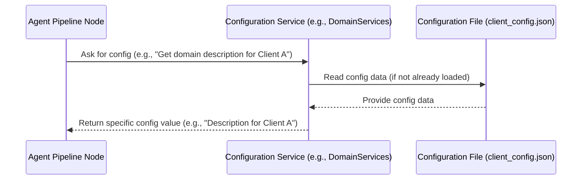

# Chapter 6: Configuration Services

Welcome back! In the previous chapters, we've built up our understanding of how the `7thgear-ai-service-mle` project handles requests, from the [Chapter 1: FastAPI Application](01_fastapi_application_.md) receiving the initial call to the [Chapter 4: Agent Pipeline (LangGraph)](04_agent_pipeline__langgraph__.md) processing the data stored in the [Chapter 5: Agent State](05_agent_state_.md).

Now, imagine our summarization pipeline is running. A Node in the pipeline needs to generate key points using a Large Language Model (LLM). To do this effectively, the LLM needs specific instructions, often called "prompts." But these prompts might need to be different depending on *who* the client is or *what type of meeting* the transcript is from. For example:

*   A sales team might need key points formatted differently than a customer support team.
*   A stand-up meeting summary might need different details emphasized compared to a detailed project planning meeting.

Hardcoding all these variations directly into the processing code would be messy and difficult to update. If a client needs a slight tweak to their prompt, we shouldn't have to change and redeploy the core processing code.

This is where **Configuration Services** come in.

Think of Configuration Services as the service's **"Settings Library"** or **"Rule Book."** Instead of hardcoding specific values or behaviors, the processing logic asks the Configuration Services, "Hey, for this job (which is for Client X and is a Meeting Type Y), what is the correct prompt for extracting key points?" or "What are the specific rules for this type of interaction?"

These services are responsible for loading settings and rules from external sources (like configuration files) and providing them to the rest of the application on demand. They allow the service's behavior to be customized dynamically based on factors like client domain or interaction type, *without* requiring changes to the underlying processing code.

Our central use case we'll look at is: **How does an Agent Pipeline Node get the right prompts and settings based on the specific summarization job it's working on?** The Configuration Services provide this capability.

### What are Configuration Services in Our Project?

In our project, Configuration Services are dedicated classes designed to read settings from configuration files and provide specific pieces of information when requested. They typically load configuration once when the service starts or when the service class is first used, and then offer methods to retrieve filtered or specific data from that configuration.

You can find these services in the `src\services` directory, often named something like `config_domain_services.py` or `config_interaction_services.py`. The provided code snippets show two such services:

1.  **`DomainServices`**: This service focuses on configuration specific to the **client domain** or account. This might include domain-specific descriptions, examples, or rules that are unique to a particular customer using the service.
2.  **`InteractionServices`**: This service focuses on configuration specific to the **type of interaction** or meeting. This could include different playbooks (overall summary structures), prompts, or examples tailored for different meeting types (e.g., sales calls, support calls, internal meetings).

Both services read from a central configuration file, specified by `client_config_path` (which points to something like `config/client_config.json`).

### How Configuration Services Work (High-Level)

Here's a simple diagram illustrating the interaction:



1.  An **Agent Pipeline Node** (or another part of the service needing configuration) calls a method on a **Configuration Service** instance.
2.  The **Configuration Service** first checks if it has already loaded the configuration file. If not, it reads the data from the **Configuration File**.
3.  It then processes the loaded data to find the specific piece of information requested by the Node (e.g., finding the section for 'Client A' and extracting the 'domain_description').
4.  Finally, the Configuration Service returns the requested configuration value back to the Node.

### Looking at the Code

Let's look at simplified snippets from the provided code files to understand how these services are implemented.

#### `DomainServices`

This class in `src\services\config_domain_services.py` is responsible for client-specific configurations.

```python
# src\services\config_domain_services.py (simplified)

from src.core.path_setup import client_config_path
from src.core.utils import load_json_from_path # Helper to load JSON

class DomainServices:
    def __init__(self):
        # Load the configuration file when the service is created
        self.config = load_json_from_path(client_config_path)

    def _get_object_for_domain_name(self, domain_name: str):
        """Helper to find the config object for a specific domain."""
        # Search for the domain in the loaded config
        try:
            obj = [
                domain
                for domain in self.config["domains"]
                if domain["domain_name"] == domain_name.lower() # Case-insensitive match
            ][0]
        except IndexError:
            # Handle case where domain is not found
            raise Exception(f"Can't find domain '{domain_name}' in config.")
        return obj

    def get_domain_description(self, domain_name):
        """Get the specific domain description for a domain."""
        obj = self._get_object_for_domain_name(domain_name)
        return obj.get("domain_description", "") # Return the description, or empty string if not found
```

**Explanation:**

*   `__init__(self)`: When you create an instance of `DomainServices` (like `DomainServices()`), this method runs. It uses a helper function `load_json_from_path` to read the contents of the `client_config.json` file and stores it in `self.config`. This typically happens only once.
*   `_get_object_for_domain_name(self, domain_name)`: This is an internal helper method. It searches within the loaded `self.config` data (specifically under the `"domains"` key) to find the dictionary object corresponding to the requested `domain_name`. It includes basic error handling if the domain isn't found.
*   `get_domain_description(self, domain_name)`: This is a public method that other parts of the service can call. It uses the helper method to find the correct domain object and then extracts and returns the value associated with the `"domain_description"` key from that object.

#### `InteractionServices`

This class in `src\services\config_interaction_services.py` handles configuration based on the meeting type.

```python
# src\services\config_interaction_services.py (simplified)

from loguru import logger
from src.core.path_setup import client_config_path
from src.core.utils import load_json_from_path

class InteractionServices:
    def __init__(self):
        # Load the configuration file when the service is created
        self.config = load_json_from_path(client_config_path)

    def _get_object_for_interaction_type(
        self, interaction_type_function, interaction_type_functional_objective
    ):
        """Helper to find the config object for a specific interaction type."""
        # Use default values if type/objective are not provided
        func = interaction_type_function or "generic"
        obj = interaction_type_functional_objective.lower() or "generic_call"

        # Search for the interaction type in the loaded config
        objects = [
            item for item in self.config["interaction_types"]
            if item["interaction_type_function"] == func
            and item["interaction_type_functional_objective"] == obj
        ]
        # Return the found object, or a default structure if not found
        if objects:
            return objects[0]
        else:
             logger.debug(f"Interaction type {func}/{obj} not found in config, using defaults.")
             return { # Return a default structure
                 "interaction_type_function": func,
                 "interaction_type_functional_objective": obj,
                 "playbook": {}, # Default empty playbook
                 "examples": []  # Default empty examples
             }

    def get_interaction_playbook(
        self, interaction_type_function, interaction_type_functional_objective
    ):
        """Get the specific playbook configuration for an interaction type."""
        obj = self._get_object_for_interaction_type(
            interaction_type_function, interaction_type_functional_objective
        )
        return obj.get("playbook", {}) # Return the playbook, or an empty dict if not found

    def get_interaction_type_examples_key_point(
        self, interaction_type_function, interaction_type_functional_objective
    ):
        """Get key point examples for an interaction type."""
        obj = self._get_object_for_interaction_type(
            interaction_type_function, interaction_type_functional_objective
        )
        # Find the specific examples of type "key_points"
        examples = obj.get("examples", [])
        kp_examples = [
            example for example in examples if example.get("type") == "key_points"
        ]
        return kp_examples[0].get("examples") if kp_examples else [] # Return examples or empty list
```

**Explanation:**

*   `__init__(self)`: Similar to `DomainServices`, this loads the configuration file into `self.config` when the service is initialized.
*   `_get_object_for_interaction_type(...)`: This internal helper searches the loaded config (under `"interaction_types"`) based on the `interaction_type_function` and `interaction_type_functional_objective`. It includes logic to use "generic" values if the specific type isn't found or provided, and it logs a message if it falls back to defaults. It returns the found object or a simple default structure.
*   `get_interaction_playbook(...)`: A public method to retrieve the `"playbook"` configuration for a specific interaction type, using the helper.
*   `get_interaction_type_examples_key_point(...)`: A public method that shows how you can retrieve specific nested data (examples of a certain "type") from the configuration for a given interaction type.

### Using Configuration Services in the Pipeline

So, how do Agent Pipeline Nodes use these services?

Remember the [Chapter 5: Agent State](05_agent_state_.md)? The `SummarizerState` object that flows through the pipeline contains information about the job, including the `account_domain` and interaction-related details.

A Node (or a module it calls) that needs configuration will typically:

1.  Access the `account_domain` and interaction type information from the `SummarizerState` object it received.
2.  Create an instance of the relevant Configuration Service (`DomainServices` or `InteractionServices`).
3.  Call the appropriate getter method on the service, passing the domain/interaction type information from the State.
4.  Receive the specific configuration (like a prompt string, a list of examples, or a playbook structure) needed for its task.

```python
# src/agent/nodes.py or src/key_points_extractor/main.py (Conceptual Snippet)

from src.agent.states import SummarizerState # Import the State definition
from src.services.config_domain_services import DomainServices # Import Config Service
from src.services.config_interaction_services import InteractionServices # Import Config Service
# ... other imports ...

# Inside a Node function or a function called by a Node
def SomeProcessingFunction(state: SummarizerState):
    # ... other node logic ...

    # 1. Get necessary context from the State
    domain_name = state["account_domain"]
    interaction_func = state["interaction_type_function"] # Assume these are in the state
    interaction_objective = state["interaction_type_functional_objective"]

    # 2. Get configuration using the services
    domain_service = DomainServices() # Create service instance
    interaction_service = InteractionServices() # Create service instance

    domain_description = domain_service.get_domain_description(domain_name)
    key_point_examples = interaction_service.get_interaction_type_examples_key_point(
        interaction_func, interaction_objective
    )
    interaction_playbook = interaction_service.get_interaction_playbook(
         interaction_func, interaction_objective
    )


    # 3. Use the retrieved configuration (e.g., build an LLM prompt)
    prompt = f"""
    You are an AI assistant summarizing a meeting.
    The client domain is related to: {domain_description} # Use domain config
    The meeting type is: {interaction_func} - {interaction_objective} # Use interaction config
    Here are some examples of good key points: {key_point_examples} # Use examples from config
    Follow this playbook structure: {interaction_playbook} # Use playbook config

    Transcript excerpt: {state['excerpt_text']} # Use data from State
    ... (rest of prompt using data from state and config)
    """

    # Now pass this dynamically built prompt to the LLM module (Chapter 7)
    # llm_result = call_llm_module(prompt, ...)

    # ... process llm_result and update state ...

    return state # Return updated state
```

This conceptual snippet shows how data from the [Chapter 5: Agent State](05_agent_state_.md) (like `account_domain`, interaction type) is used as *input* for the Configuration Services. The services then use this input to look up and return the correct configuration (like `domain_description`, `key_point_examples`), which is then used by the processing logic (e.g., to construct a prompt for an LLM).

### Why Use Configuration Services?

Employing dedicated Configuration Services brings significant benefits:

*   **Flexibility and Customization:** Easily adapt the service's behavior for different clients or meeting types by simply changing configuration files, without modifying code.
*   **Reduced Hardcoding:** Keeps prompts, rules, and settings out of the core processing logic, making the code cleaner and easier to maintain.
*   **Separation of Concerns:** The responsibility of *loading and providing* configuration is separate from the responsibility of *using* that configuration to process data.
*   **Easier Updates:** Configuration can potentially be updated and reloaded without needing a full service redeployment (though the current implementation loads on initialization).
*   **Testability:** Configuration can be mocked for testing processing logic, or the loading logic itself can be tested independently.

Configuration Services are crucial for making the `7thgear-ai-service-mle` flexible and adaptable to various client needs and interaction types without increasing the complexity of the core AI processing logic.

### Conclusion

In this chapter, we learned about Configuration Services, such as `DomainServices` and `InteractionServices`. These services act as the "Settings Library" for our application, loading configuration from files and providing specific settings (like domain descriptions, interaction playbooks, or examples) based on context from the [Chapter 5: Agent State](05_agent_state_.md). By abstracting configuration lookup, we make our core processing logic cleaner, more flexible, and easier to update for different clients and meeting types.

Now that we understand how configuration is managed and provided, we can move on to the modules that *use* this configuration to perform the actual AI tasks, like interacting with Large Language Models to generate summary elements.

Let's dive into the components that handle the heavy lifting with LLMs in [Chapter 7: LLM Processing Modules](07_llm_processing_modules_.md).

---

Generated by [AI Codebase Knowledge Builder](https://github.com/The-Pocket/Tutorial-Codebase-Knowledge)