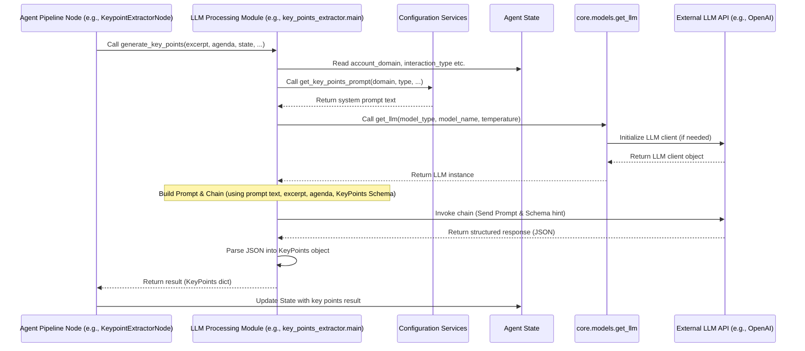

# Chapter 7: LLM Processing Modules

Welcome back! In our journey through the `7thgear-ai-service-mle` project, we've seen how our service receives requests via the [Chapter 1: FastAPI Application](01_fastapi_application_.md), validates data using [Chapter 2: API Data Schemas](02_api_data_schemas_.md), interacts with external systems like S3 using [Chapter 3: External Service Integrations](03_external_service_integrations_.md), and orchestrates the entire complex summarization workflow using the [Chapter 4: Agent Pipeline (LangGraph)](04_agent_pipeline__langgraph_.md). We also saw how the [Chapter 5: Agent State](05_agent_state_.md) carries all the information throughout the pipeline and how [Chapter 6: Configuration Services](06_configuration_services_.md) provide dynamic settings and prompts based on the job context.

Now, we arrive at the components that perform the *actual* intelligent work using Large Language Models (LLMs). The Agent Pipeline defines *when* something should happen (e.g., "extract key points now"), but it doesn't contain the complex logic of *how* to talk to an LLM, format the prompt, handle the API call, and process the LLM's response for that specific task.

Imagine our factory assembly line again. The Agent Pipeline ([Chapter 4: Agent Pipeline (LangGraph)](04_agent_pipeline__langgraph_.md)) is the overall layout and automated system directing packages. The [Chapter 5: Agent State](05_agent_state_.md) is the backpack traveling with the package. The [Chapter 6: Configuration Services](06_configuration_services_.md) provide the specific instructions needed for this package type. But for tasks like "extract key points," you need a specialized workstation with a skilled worker and the right tools (the LLM).

This is where **LLM Processing Modules** come in.

These are specialized components, each acting like a dedicated **"AI Worker Station"** on our assembly line. Each station is designed to perform a *single, specific task* that requires interacting with an LLM. For example, one station is good at extracting key points, another at finding action items, another at analyzing sentiment, and so on.

Each module encapsulates:

1.  The knowledge of **how to build the right prompt** for its task (often using information from the [Chapter 5: Agent State](05_agent_state_.md) and [Chapter 6: Configuration Services](06_configuration_services_.md)).
2.  The logic to **call the LLM API**.
3.  The instructions (often using Pydantic Schemas - [Chapter 2: API Data Schemas](02_api_data_schemas_.md)) to tell the LLM **how to format its response**.
4.  The code to **process the LLM's raw response** and return a structured result ready to be added back to the [Chapter 5: Agent State](05_agent_state_.md).

By having these specialized modules, the Nodes in the [Chapter 4: Agent Pipeline (LangGraph)](04_agent_pipeline__langgraph_.md) can stay simple. A Node just needs to know *which* LLM Processing Module to call for its task and pass it the necessary data from the State. It doesn't need to know the intricate details of prompting or API calls.

Our central use case - **generating a structured summary from a raw transcript** - involves many distinct analysis steps (finding agendas, extracting key points, identifying action items, etc.). Each of these steps that requires an LLM is handled by a dedicated LLM Processing Module.

### What are LLM Processing Modules in Our Project?

In our project, LLM Processing Modules are typically found in separate directories under `src/`, named after the specific task they perform, like `src/key_points_extractor`, `src/action_items_extractor`, `src/sentiment_analyzer`, `src/agenda_extractor`, etc.

Each of these directories usually contains:

*   `main.py`: The main Python file with the function(s) that perform the core task using an LLM.
*   `prompts.py`: Contains the specific system prompts and human message templates used for interacting with the LLM for this task.
*   `schema.py`: Contains the Pydantic Schema ([Chapter 2: API Data Schemas](02_api_data_schemas_.md)) defining the expected structure of the LLM's output for this task.
*   `__init__.py`: Makes the directory a Python package, often importing the main function(s) from `main.py` to make them easily accessible.

Let's focus on the `main.py` file within one of these modules, as this is where the LLM interaction logic lives. We'll use `src/key_points_extractor/main.py` as our example.

### How an LLM Processing Module Works

Let's look at a simplified version of the `generate_key_points` function from `src/key_points_extractor/main.py`. This is the function that an Agent Pipeline Node ([Chapter 4: Agent Pipeline (LangGraph)](04_agent_pipeline__langgraph_.md)) calls to get key points for a specific part of the transcript.

```python
# src/key_points_extractor/main.py (Simplified)

from langchain_core.prompts import ChatPromptTemplate
from src.key_points_extractor.prompts import get_key_points_prompt # 1. Get Prompt
from src.key_points_extractor.schema import KeyPoints             # 2. Get Output Schema
from src.core.models import get_llm                               # 3. Get LLM Utility
from src.agent.states import SummarizerState                     # 4. Access State

# Function called by Agent Pipeline Node
def generate_key_points(
    agenda,
    excerpt,
    model_type,
    model_name,
    temperature,
    state: SummarizerState, # Input includes data + State
    *args,
    **kwargs
):
    """Generate key points for an excerpt using LLM."""

    # Use Config Services implicitly via get_key_points_prompt
    system_prompt_text = get_key_points_prompt(
        domain_name=state.get("account_domain"),
        interaction_type_function=state.get("interaction_type_function"),
        # ... pass other state/config info needed for prompt ...
    )

    # 5. Build the Prompt
    prompt = ChatPromptTemplate.from_messages([
        ("system", system_prompt_text),
        ("human", "transcript_excerpt: {transcript} \n agenda: {agenda}"),
    ])

    # 6. Get the LLM instance (abstracts away provider details)
    llm = get_llm(model_type=model_type, model_name=model_name, temperature=temperature)

    # 7. Bind the Output Schema to the LLM (ask LLM to format output)
    structured_llm = llm.with_structured_output(KeyPoints) # Use KeyPoints schema

    # 8. Combine Prompt and LLM into a chain
    processing_chain = prompt | structured_llm

    # 9. Invoke the chain with specific data for THIS excerpt
    result = processing_chain.invoke({
        "transcript": excerpt,
        "agenda": agenda,
        # ... pass other dynamic info ...
    })

    # 10. Return the structured result
    return result.dict() # Return as a dictionary

```

**Explanation of the steps within the module:**

1.  **Import Prompt Logic:** It imports a function (`get_key_points_prompt`) from the module's `prompts.py` file. This function is responsible for constructing the specific system prompt message for the LLM. As shown in the code snippet, it often takes context from the [Chapter 5: Agent State](05_agent_state_.md) (like `account_domain`, interaction type) to potentially customize the prompt using [Chapter 6: Configuration Services](06_configuration_services_.md).
2.  **Import Output Schema:** It imports the Pydantic model (`KeyPoints`) from the module's `schema.py` file. This model defines the exact JSON structure the LLM is expected to return (e.g., a list of strings under a key like `"key_points"`).
3.  **Import LLM Utility:** It imports a shared utility function (`get_llm`) from `src/core/models.py`. This function hides the complexity of initializing different LLM clients (like OpenAI, Anthropic via Bedrock, etc.). You just tell it `model_type` ("openai", "bedrock") and `model_name` ("gpt-4o", "anthropic.claude-3-sonnet-20240229-v1:0"), and it gives you a Langchain-compatible LLM object.
4.  **Access State:** The function receives the [Chapter 5: Agent State](05_agent_state_.md) object as an argument. This allows it to access context like the `account_domain`, `interaction_type`, and potentially other information needed for prompting or processing.
5.  **Build the Prompt:** It uses Langchain's `ChatPromptTemplate` to combine the system prompt text (generated dynamically using info from State/Config) and the human message template into a complete prompt structure.
6.  **Get LLM Instance:** It calls `get_llm` to get the appropriate LLM client instance configured with the specified model name and temperature.
7.  **Bind Output Schema:** This is a powerful feature from Langchain/Pydantic. `llm.with_structured_output(KeyPoints)` tells the LLM wrapper: "Configure the LLM call to strongly encourage/force the LLM to respond with JSON data that strictly matches the structure defined by the `KeyPoints` Pydantic model." This makes parsing the LLM's response much more reliable.
8.  **Combine into Chain:** Langchain's Expression Language (`|`) is used to create a simple sequence: first format the `prompt`, then send it to the `structured_llm`.
9.  **Invoke the Chain:** `processing_chain.invoke({...})` actually makes the call to the LLM API. It passes the specific dynamic data for this task (like the `excerpt` text and the `agenda` name for which key points are needed) to fill in the human message template.
10. **Return Result:** The `structured_llm` returns an object (often a Pydantic model instance) that already conforms to the `KeyPoints` schema. The function converts this to a dictionary (`result.dict()`) and returns it.

This dictionary result (e.g., `{"key_points": ["point 1", "point 2"]}`) is then received by the Agent Pipeline Node, which will update the [Chapter 5: Agent State](05_agent_state_.md) with this new information.

Other LLM Processing Modules follow a similar pattern, but with different prompts (`prompts.py`), different output schemas (`schema.py`), and slightly different input data based on their specific task.

### Flow with LLM Processing Modules

Let's add the LLM Processing Module and the External LLM API to our conceptual flow diagram.



This diagram shows how the Agent Pipeline Node delegates the specific LLM task to the LLM Processing Module. The module uses context from the State and Configuration to build the request for the External LLM API, handles the API interaction (via the shared utility), and processes the structured response before returning it back to the Node for State updates.

### Why Use LLM Processing Modules?

Encapsulating LLM interaction logic into these task-specific modules provides several significant benefits:

*   **Modularity & Separation of Concerns:** The complex logic of prompting, API calls, and response parsing for a specific task (like extracting key points) is kept separate from the Agent Pipeline logic (which just orchestrates the steps) and the core LLM model utility (which just provides a way to talk to the LLM).
*   **Reusability:** If another part of the system later needs to extract key points (perhaps for a different purpose outside the main summarization pipeline), it can reuse the `key_points_extractor` module.
*   **Maintainability:** If the prompting strategy for action items needs to change, or if the expected output format is slightly adjusted, you only need to modify the code within the `src/action_items_extractor` directory.
*   **Testability:** Each module can be tested independently by providing mock inputs (excerpt, state data, config) and verifying that it generates the correct prompt, calls the LLM utility with the right parameters, and processes the response as expected.
*   **Abstraction of LLM Details:** The modules use the `get_llm` utility, meaning the module's core logic (`generate_key_points`) doesn't need to know if it's talking to OpenAI or Bedrock; that detail is handled by the utility, making it easier to switch or support multiple LLM providers.
*   **Clear Input/Output Contract:** Each module's main function has clear inputs (data needed for the task, relevant state/config info) and returns a structured output (defined by its schema) that's easy for the calling Node to integrate into the State.

LLM Processing Modules are the workhorses of the summarization pipeline, performing the actual content analysis using LLMs in a structured, maintainable, and reusable way.

### Conclusion

In this chapter, we explored LLM Processing Modules, the specialized components responsible for performing specific analysis tasks using Large Language Models. We saw how they encapsulate the logic for prompt generation (leveraging [Chapter 5: Agent State](05_agent_state_.md) and [Chapter 6: Configuration Services](06_configuration_services_.md)), interacting with LLMs (via shared utilities), and structuring responses (using [Chapter 2: API Data Schemas](02_api_data_schemas_.md)). By calling these modules, the Nodes in the [Chapter 4: Agent Pipeline (LangGraph)](04_agent_pipeline__langgraph_.md) can perform complex AI tasks without needing to manage the low-level LLM interaction details themselves.

The results generated by these modules are crucial pieces of information for the final summary. This information needs to be stored persistently so it's not lost and can be retrieved later. This leads us to the next layer of the system.

Let's move on to understand how our service handles saving and retrieving data persistently in [Chapter 8: Database Layer](08_database_layer_.md).

---

Generated by [AI Codebase Knowledge Builder](https://github.com/The-Pocket/Tutorial-Codebase-Knowledge)