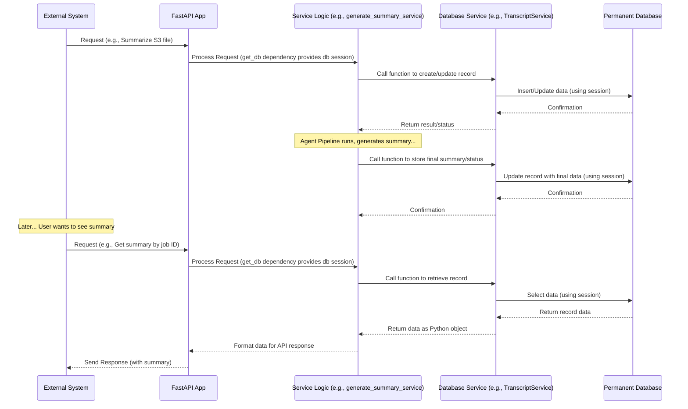

# Chapter 8: Database Layer

Welcome back! So far in our tutorial, we've learned how the [Chapter 1: FastAPI Application](01_fastapi_application_.md) receives requests, how [Chapter 2: API Data Schemas](02_api_data_schemas_.md) define the format of the data, how [Chapter 3: External Service Integrations](03_external_service_integrations_.md) help us interact with outside systems, how the [Chapter 4: Agent Pipeline (LangGraph)](04_agent_pipeline__langgraph_.md) orchestrates the processing steps, and how the [Chapter 5: Agent State](05_agent_state_.md) carries all the relevant data through the pipeline. We also saw in [Chapter 6: Configuration Services](06_configuration_services_.md) how dynamic settings are provided, and in [Chapter 7: LLM Processing Modules](07_llm_processing_modules_.md) how the core AI tasks are performed using LLMs.

Now, where does all this valuable information go after the processing is complete? The raw transcript, the beautiful summary generated by the LLMs, the action items, the key points, the status of the job – this data needs to be saved permanently so we can look it up later, track progress, or even resume interrupted jobs. The data can't just disappear when the server restarts or the specific request finishes.

This is where the **Database Layer** comes in.

Think of the Database Layer as our service's **"Permanent Filing Cabinet"** or **"Long-Term Memory."** It's the part of the system responsible for:

1.  **Storing Data:** Taking the data generated or processed by the application (like raw transcripts, processing status, final summaries, intermediate results) and writing it down somewhere safe where it won't be lost.
2.  **Retrieving Data:** Finding and reading previously stored data when other parts of the application need it (e.g., an API endpoint to show a job's status or retrieve a past summary).
3.  **Organizing Data:** Defining *how* the data is structured and how different pieces of data relate to each other (e.g., knowing which action items belong to which meeting summary).

Our central use case involves **generating a summary and saving it**. This requires the Database Layer to store the original transcript, track the job's status as it moves through the pipeline, save the final summary and its detailed components (like key points and action items), and allow us to fetch this information later.

### Why Do We Need a Database?

While the [Chapter 5: Agent State](05_agent_state_.md) holds the data *during* processing within the LangGraph pipeline, that state exists primarily in memory. If the application stops or crashes, that in-memory state is lost (unless a persistent checkpointer is used, which itself relies on the database!).

A database provides **persistence**. It stores data on disk, making it available even after the application restarts. It also handles complex tasks like searching for specific records, managing relationships between different types of data, and ensuring that multiple parts of the application can read and write data safely at the same time.

### Key Concepts of the Database Layer

To manage this permanent storage, our project uses a few key components:

1.  **SQLAlchemy Models:** These are Python classes that define the structure of the tables in our database. They tell us what kind of "files" go into our "filing cabinet" and what information (columns) each file should contain.
2.  **SQLAlchemy Engine and Sessions:** The Engine handles the actual connection details to the database server. A Session is like an open drawer in the filing cabinet – it's what our application code uses to interact with the data (add, read, update, delete).
3.  **Alembic Migrations:** As our application evolves, we might need to store new types of data or change the structure of existing data. Migrations are special scripts that manage these changes to the database structure over time without losing the data already stored.

Let's look at how these pieces work together.

### Defining Data Structure with SQLAlchemy Models

The core of our database structure is defined by Python classes in `src\db\models.py`. These classes use SQLAlchemy's Object-Relational Mapper (ORM) to map Python objects to database tables.

Think of each class here as the blueprint for a different type of record in our filing cabinet: a `Transcript` record, an `Agenda` record, a `KeyPoint` record, and so on.

Here's a simplified look at the `Transcript` model:

```python
# src\db\models.py (Simplified Transcript model)

from sqlalchemy import Column, String, JSON, Enum, Boolean, DateTime, ForeignKey # Important column types
from sqlalchemy.dialects.postgresql import UUID # For unique IDs
from src.db.database import Base # Base class for SQLAlchemy models
from src.db.enums import TranscriptStatus # Enum for status values
from datetime import datetime, timezone # For timestamps
from uuid import uuid4 # For generating UUIDs

class BaseModel(Base): # A base class for common fields
    __abstract__ = True # This class won't be a table itself

    id = Column(UUID(as_uuid=True), primary_key=True, nullable=False, default=uuid4)
    created_at = Column(DateTime(timezone=True), default=lambda: datetime.now(timezone.utc))
    updated_at = Column(DateTime(timezone=True), default=lambda: datetime.now(timezone.utc), onupdate=lambda: datetime.now(timezone.utc))

class Transcript(BaseModel): # Inherits common fields from BaseModel
    __tablename__ = "transcripts" # The name of the table in the database

    job_id = Column(String, nullable=False) # A column for the job identifier
    status = Column(Enum(TranscriptStatus), nullable=False) # Column using our status enum
    has_error = Column(Boolean, default=False) # Boolean column
    errors = Column(String, nullable=True) # String column, can be empty (None)
    s3_object_url = Column(String, nullable=False) # String column, required
    raw_transcript_text = Column(String, nullable=True) # Full transcript text
    processed_output_json = Column(JSON, nullable=True) # Summary output as JSON
    state_info = Column(JSON, nullable=True) # For storing LangGraph state summary/details
    request_payload = Column(String, nullable=True) # Original request payload

```

**Explanation:**

*   `class Transcript(BaseModel):`: Defines a Python class `Transcript` that will map to a database table. It inherits from `BaseModel` to automatically get `id`, `created_at`, and `updated_at` columns.
*   `__tablename__ = "transcripts"`: Specifies the name of the table in the database.
*   `Column(...)`: Each line starting with `Column` defines a column in the `transcripts` table.
    *   `String`, `JSON`, `Boolean`, `DateTime`, `Enum`, `UUID`: These specify the data type for the column. `JSON` is useful for storing flexible dictionary/list structures like the summary output or state info. `UUID` is used for unique identifiers.
    *   `primary_key=True`: This column is the main identifier for each row.
    *   `nullable=False`: This column *must* have a value; it cannot be empty. `nullable=True` means it can be empty (`NULL` in SQL).
    *   `default=...`, `onupdate=...`: These set default values or specify what happens when a row is updated (like automatically setting timestamps).
*   `Enum(TranscriptStatus)`: This ensures the `status` column can only contain values from the `TranscriptStatus` enum we define (like "inprogress", "done").

Other files like `src\db\enums.py` define the possible values for status fields.

The `Agenda`, `ActionItem`, `KeyPoint`, `ThemeSentimentReport`, and `FlaggedTranscript` models in `src\db\models.py` follow a similar pattern, defining tables for different aspects of the summarization data. They use `ForeignKey` to link related data (e.g., `KeyPoint` has `agenda_id` which points to the `id` of an `Agenda` record, showing that key points belong to a specific agenda item).

### Connecting to and Interacting with the Database

The code for establishing the connection to the database and getting a "session" to perform operations is in `src\db\database.py`.

```python
# src\db\database.py (Simplified)

from sqlalchemy import create_engine # To set up the connection
from sqlalchemy.ext.declarative import declarative_base # Base class helper
from sqlalchemy.orm import sessionmaker # To create sessions
from src import settings # Where our database URL is configured

# Configure the database connection using the URL from settings
engine = create_engine(settings.DATABASE_URL)

# Create a session factory
SessionLocal = sessionmaker(autocommit=False, autoflush=False, bind=engine)

# Base class used by our models (src/db/models.py)
Base = declarative_base()

# Dependency to get a database session for FastAPI requests
def get_db():
    db = SessionLocal() # Create a new session
    try:
        yield db # Provide the session
    finally:
        db.close() # Close the session afterwards
```

**Explanation:**

*   `create_engine(settings.DATABASE_URL)`: This line is like finding the address of the filing cabinet and setting up the main connection point. It uses the database connection string from our configuration (`settings.DATABASE_URL`) to configure how SQLAlchemy will talk to the database server (e.g., PostgreSQL).
*   `sessionmaker(...)`: This creates a factory that will produce database sessions. Each session is an independent workspace to interact with the database for a specific task.
*   `Base = declarative_base()`: This provides a base class that all our SQLAlchemy models (like `Transcript`, `Agenda`) need to inherit from, linking them to the SQLAlchemy system.
*   `get_db()`: This is a common pattern in FastAPI applications using databases. It's a **dependency** that FastAPI can automatically inject into your API endpoint or service functions. When a request comes in that needs database access, FastAPI calls `get_db()`, which creates a new session (`db = SessionLocal()`), provides it (`yield db`), and automatically closes it (`db.close()`) when the request is finished, even if errors occur. This ensures database connections are managed properly.

### Using the Database Layer in the Application

Other parts of the application, particularly services in `src\services` or endpoint handlers, use the `get_db` dependency to get a database session and then use that session to query or store data.

Let's look at simple examples of retrieving and storing data using SQLAlchemy sessions, drawing from `src\services\transcript_services.py` and `src\services\db_storage_services.py`.

#### Retrieving Data

The `TranscriptService` can fetch a transcript record by its `job_id`.

```python
# src\services\transcript_services.py (Simplified retrieval)

from fastapi import HTTPException
from sqlalchemy.orm import Session # Import Session type hint
from src.db.models import Transcript # Import the model

class TranscriptService:
    def __init__(self, db: Session): # Service receives the database session
        self.db = db

    def get_transcript_object_by_job_id(self, job_id: str) -> Transcript:
        """Fetches a Transcript object from the database by job_id."""
        print(f"Fetching transcript for job ID: {job_id}") # Log for clarity
        transcript = (
            self.db.query(Transcript) # Start a query on the Transcript model/table
            .filter(Transcript.job_id == job_id) # Add a filter condition
            .order_by(Transcript.created_at.desc()) # Order results (get latest)
            .first() # Get the first result (or None if not found)
        )

        if not transcript:
            # Raise error if not found (often handled at API level)
            raise HTTPException(status_code=404, detail="Transcript not found")

        print("Transcript found.")
        return transcript # Return the Python object representing the row

# How this might be used by an API endpoint or another service:
# @router.get("/transcripts/{job_id}")
# def read_transcript(job_id: str, db: Session = Depends(get_db)): # FastAPI injects the session
#     transcript_service = TranscriptService(db)
#     transcript_data = transcript_service.get_transcript_object_by_job_id(job_id)
#     # ... format and return transcript_data ...

```

**Explanation:**

*   The `TranscriptService` constructor receives a database session (`db: Session`).
*   `self.db.query(Transcript)`: This tells SQLAlchemy we want to query the `transcripts` table, and we want the results returned as `Transcript` Python objects.
*   `.filter(Transcript.job_id == job_id)`: This adds a `WHERE` clause to the SQL query, filtering for rows where the `job_id` column matches the provided value.
*   `.order_by(...)`, `.first()`: These refine the query to get the single, most recently created transcript with that job ID.
*   The method returns a `Transcript` Python object, whose attributes (`transcript.status`, `transcript.raw_transcript_text`, etc.) correspond to the columns in the database row.

#### Storing/Updating Data

When the Agent Pipeline finishes processing, or even during processing (e.g., to update the status or save intermediate results), data needs to be saved or updated in the database.

```python
# src\services\db_storage_services.py (Simplified storing)

from sqlalchemy.orm import Session # Import Session type hint
from src.db.models import Transcript, Agenda, KeyPoint # Import models
from src.db.enums import TranscriptStatus # Import status enum

# This function might be called after a job finishes or its status changes
def update_transcript_status(db: Session, transcript_id: str, status: TranscriptStatus, final_summary_data=None, errors=None):
    """Updates the status and possibly other fields for a transcript record."""
    print(f"Updating status for transcript ID: {transcript_id} to {status.value}") # Log

    transcript = db.query(Transcript).filter(Transcript.id == transcript_id).first()

    if not transcript:
        print("Transcript not found for update.")
        return # Or raise error

    transcript.status = status # Update the status attribute of the Python object
    transcript.has_error = errors is not None and len(errors) > 0 # Update error flag
    if errors:
        transcript.errors = str(errors) # Store errors (simplification)
    if final_summary_data:
        transcript.processed_output_json = final_summary_data # Store the final summary JSON

    db.commit() # Commit the changes to the database
    db.refresh(transcript) # Refresh the object to get updated fields (like updated_at)
    print("Transcript status updated.")

# A very simplified example of storing a new Agenda and KeyPoint
def store_one_agenda_with_keypoint(db: Session, transcript_obj: Transcript, topic: str, key_point_text: str):
    """Stores one agenda and one key point linked to a transcript."""
    print(f"Storing agenda '{topic}' for transcript {transcript_obj.id}") # Log

    # Create a new Agenda object
    agenda = Agenda(transcript_id=transcript_obj.id, topic=topic, excerpt="...") # Fill required fields

    db.add(agenda) # Stage the new object for insertion
    db.commit() # Insert the new agenda into the database
    db.refresh(agenda) # Get the database-assigned ID for the agenda

    print(f"Stored agenda with ID: {agenda.id}") # Log

    # Create a new KeyPoint object, linking it to the Agenda and Transcript
    key_point_entry = KeyPoint(
        agenda_id=agenda.id, # Link to the newly created agenda
        transcript_id=transcript_obj.id, # Link to the transcript
        summary=key_point_text,
        topic_sentiment="neutral" # Fill other fields
    )

    db.add(key_point_entry) # Stage the new key point
    db.commit() # Insert the key point into the database

    print("Stored key point.")
```

**Explanation:**

*   Again, the function receives a database session (`db: Session`).
*   `db.query(...).filter(...).first()`: We retrieve the existing `Transcript` record we want to update.
*   `transcript.status = status`: We simply update the attributes of the Python `transcript` object. SQLAlchemy tracks these changes.
*   `db.commit()`: This is the crucial step! It sends all the staged changes (updates, additions, deletions) in the current session to the database as a single transaction. If something fails, the whole transaction can be rolled back.
*   `db.add(agenda)`, `db.add(key_point_entry)`: For new records, we create Python model instances and use `db.add()` to tell SQLAlchemy we want to insert these as new rows in their respective tables.
*   The `store_normalized_data` function in `src\services\db_storage_services.py` in the actual codebase is a more complex version of `store_one_agenda_with_keypoint`, looping through all the sections, agendas, key points, and action items from the processed output and creating the corresponding database records.

### Managing Database Structure Changes with Migrations

Over time, the data we need to store changes. We might add a new feature that requires storing sentiment scores or flag certain transcripts. Changing the database structure requires careful steps to avoid losing existing data. This is handled by Alembic, a database migration tool integrated with SQLAlchemy.

Alembic migration files are like version-controlled scripts that describe how to update the database schema from one version to the next. When you run `alembic upgrade head`, Alembic applies all the new migration scripts in order.

You can see examples of these scripts in the `migrations\versions` directory, like `1c0ed99b0610_additional_tables_for_changed_.py`.

```python
# migrations\versions\1c0ed99b0610_additional_tables_for_changed_.py (Simplified snippet)

"""additional tables for changed architecture""" # Description

from typing import Sequence, Union
import sqlalchemy as sa # SQLAlchemy library
from alembic import op # Alembic operations

# revision identifiers, used by Alembic.
revision: str = "1c0ed99b0610" # Unique ID for this migration
down_revision: Union[str, None] = "81fd74b56ef5" # ID of the previous migration

def upgrade() -> None:
    # ### commands auto generated by Alembic - please adjust! ###
    print("Running upgrade 1c0ed99b0610: creating tables agendas, action_items, key_points")
    op.create_table( # Command to create a new table
        "agendas", # Table name
        sa.Column("is_introductory", sa.Boolean(), nullable=True), # Define a column
        sa.Column("start_idx", sa.Integer(), nullable=True),
        sa.Column("end_idx", sa.Integer(), nullable=True),
        sa.Column("excerpt", sa.String(), nullable=True),
        sa.Column("transcript_id", sa.UUID(), nullable=True), # Define a column
        sa.Column("topic", sa.String(), nullable=True),
        sa.Column("topic_sentiment", sa.String(), nullable=True),
        sa.Column("id", sa.UUID(), nullable=False),
        sa.Column("created_at", sa.DateTime(timezone=True), nullable=True),
        sa.Column("updated_at", sa.DateTime(timezone=True), nullable=True),
        sa.ForeignKeyConstraint( # Define a foreign key constraint
            ["transcript_id"], # Column in this table
            ["transcripts.id"], # Column in the linked table
        ),
        sa.PrimaryKeyConstraint("id"), # Define the primary key
    )
    op.create_table( # Command to create another table
        "action_items",
        # ... column definitions ...
    )
    op.create_table( # Command to create yet another table
        "key_points",
        # ... column definitions ...
    )
    # ### end Alembic commands ###


def downgrade() -> None:
    # ### commands auto generated by Alembic - please adjust! ###
    print("Running downgrade 1c0ed99b0610: dropping tables agendas, action_items, key_points")
    op.drop_table("key_points") # Command to drop a table
    op.drop_table("action_items")
    op.drop_table("agendas")
    # ### end Alembic commands ###

```

**Explanation:**

*   Each migration file has an `upgrade` function and a `downgrade` function. `upgrade` describes how to apply the change (e.g., create a table), and `downgrade` describes how to reverse it (e.g., drop the table).
*   `alembic.op`: This object provides functions to perform database operations directly (`create_table`, `add_column`, `drop_table`, `alter_column`, etc.).
*   When you create a new SQLAlchemy model or modify an existing one, you use Alembic commands (outside the running application) to *autogenerate* a new migration script based on the differences between your models (`src\db\models.py`) and the current database schema.
*   `migrations\env.py` is the configuration file for Alembic, telling it how to connect to the database and find your models. It also includes important logic, like the `include_object` function, which tells Alembic to **ignore certain tables**, specifically those managed internally by LangGraph for its checkpointing mechanism. This prevents Alembic from trying to manage tables it didn't create.

### Database Use Case: LangGraph Checkpointing

As mentioned in [Chapter 4: Agent Pipeline (LangGraph)](04_agent_pipeline__langgraph_.md), the Database Layer is also used by LangGraph's Checkpointer feature.

The `PostgresSaver` from `langgraph.checkpoint.postgres` uses the configured database connection to store the entire state of the Agent Pipeline (`SummarizerState`) after each step. This allows the pipeline to be stopped and resumed from where it left off.

This is a *separate* use of the database compared to storing our application-specific data like `Transcript`, `Agenda`, `KeyPoint`, etc., although they use the same database connection. The LangGraph checkpointer creates its own tables (like `checkpoints`, `checkpoint_blobs`), and as seen in `migrations\env.py`, we explicitly tell Alembic to ignore these tables using the `include_object` function so that our application's migrations don't interfere with LangGraph's internal tables.

```python
# migrations\env.py (Snippet showing LangGraph tables exclusion)

# ... imports and setup ...

def include_object(object, name, type_, reflected, compare_to):
    # Ignore langgraph tables so Alembic doesn't try to manage them
    langgraph_tables = {
        "checkpoint_migrations",
        "checkpoint_writes",
        "checkpoint_blobs",
        "checkpoints",
    }
    if type_ == "table" and name in langgraph_tables:
        return False # Exclude these tables from Alembic management
    return True # Include all other tables

# ... rest of env.py ...
```

This shows the `include_object` function checking if the table name is one of LangGraph's known table names and returning `False` if it is, effectively hiding these tables from Alembic's migration process.

### Flow with the Database Layer

Let's simplify the overall flow to show where database interactions happen:



This diagram illustrates how the application uses dedicated Database Services (which internally use SQLAlchemy and database sessions provided via FastAPI dependencies) to save data generated during processing and retrieve it later when requested via the API.

### Why Use a Database Layer and SQLAlchemy?

*   **Data Persistence:** Ensures critical data (transcripts, summaries, status) survives application restarts.
*   **Structured Data:** SQLAlchemy models enforce a clear structure, making data consistent and easier to work with.
*   **Reliable Storage & Retrieval:** Databases are designed for efficient and reliable data access and modification.
*   **Data Relationships:** Foreign keys and ORM relationships allow linking related data, essential for complex outputs like summaries with nested key points and action items.
*   **Maintainable Code:** SQLAlchemy (ORM) lets developers work with Python objects instead of writing complex, error-prone SQL queries directly.
*   **Schema Management:** Alembic migrations provide a controlled way to evolve the database structure alongside the application code.

The Database Layer is fundamental for making the `7thgear-ai-service-mle` a stateful application that can track jobs over time and provide access to historical results.

### Conclusion

In this chapter, we explored the Database Layer, our service's permanent filing cabinet. We learned how SQLAlchemy Models define the structure of our data tables, how the SQLAlchemy Engine and Sessions handle connecting to and interacting with the database, and how Alembic Migrations manage changes to the database structure over time. We saw simplified examples of how application code uses database sessions to query and store data, and how LangGraph also utilizes the database for its own checkpointing needs.

With the Database Layer in place, our service can reliably store all the information it generates. This stored information is often needed by other parts of the system, such as the user-facing interface.

Let's move on to understand how our service provides data and functionality specifically for a potential user interface in [Chapter 9: Frontend API](09_frontend_api_.md).

---

Generated by [AI Codebase Knowledge Builder](https://github.com/The-Pocket/Tutorial-Codebase-Knowledge)