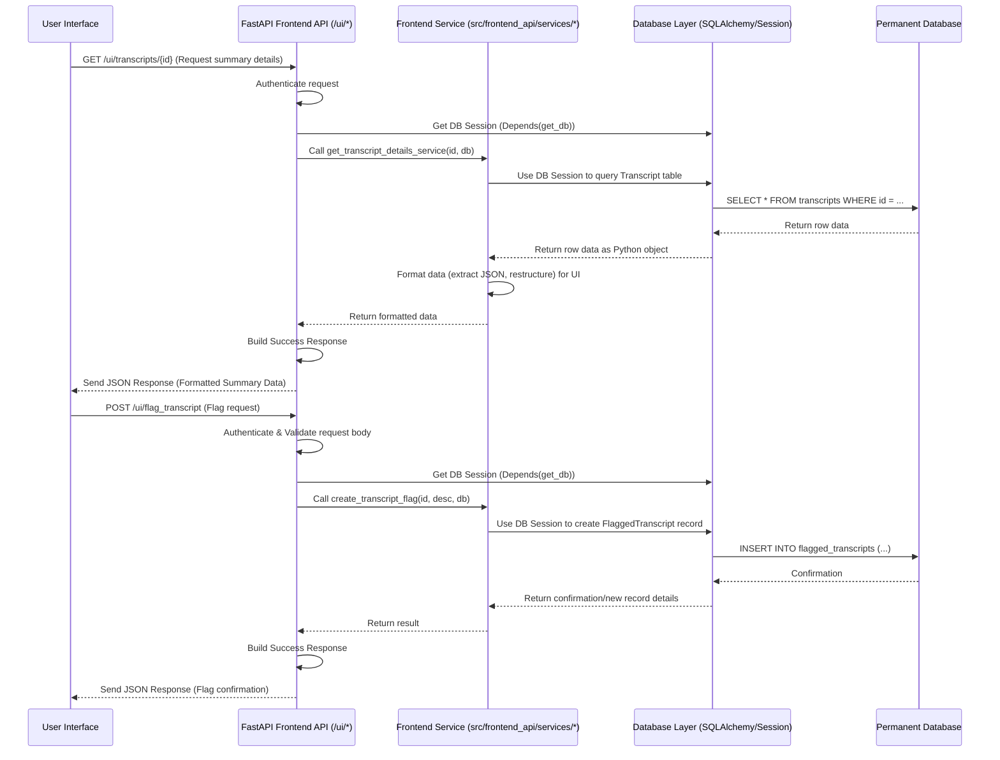

# Chapter 9: Frontend API

Welcome back! In our journey through the `7thgear-ai-service-mle` project, we've seen how our service receives requests ([Chapter 1: FastAPI Application](01_fastapi_application_.md)), processes data through a sophisticated pipeline orchestrated by [Chapter 4: Agent Pipeline (LangGraph)](04_agent_pipeline__langgraph_.md) using information carried in the [Chapter 5: Agent State](05_agent_state_.md) and external data from [Chapter 3: External Service Integrations](03_external_service_integrations_.md) and configured by [Chapter 6: Configuration Services](06_configuration_services_.md), performing core tasks with [Chapter 7: LLM Processing Modules](07_llm_processing_modules_.md). Most importantly for this chapter, we learned in [Chapter 8: Database Layer](08_database_layer_.md) how all the valuable input and processed data (like raw transcripts and final summaries) is stored permanently in our database.

Now, imagine a user wants to *see* the summaries that have been generated. They might use a website or a dashboard. How does that user interface (UI) get the list of completed jobs? How does it fetch the details of a specific summary, including the key points, action items, and sentiment analysis results? And how does a user provide feedback, like flagging a transcript if something seems wrong?

While our main API ([Chapter 1: FastAPI Application](01_fastapi_application_.md)) has endpoints for *starting* jobs (like `/api/v1/generate_summary`), those endpoints are designed for other systems to send data *into* our service. They might not provide data back in a format that's easy to display directly in a human-friendly UI. Also, a UI needs different kinds of interactions, like browsing lists or flagging specific items.

This is where the **Frontend API** comes in.

Think of the Frontend API as a **specialized information desk and feedback window** at our service building, specifically designed to serve the needs of a user interface. It doesn't initiate complex processing jobs; instead, its primary purpose is to:

1.  **Provide data:** Offer endpoints to fetch lists of jobs, detailed summary results, or specific analytical views (like topic shifts).
2.  **Format data for UI:** Present the data retrieved from the [Chapter 8: Database Layer](08_database_layer_.md) in a structure that's convenient for a frontend application to consume and display. This might involve pulling together data from multiple database tables or restructuring JSON output.
3.  **Accept UI-specific actions:** Provide endpoints for actions a user might take via a UI, like flagging a transcript for review.

Our central use case we'll explore here is: **How does a user interface display a list of summarization jobs and then show the detailed summary for a specific job?** The Frontend API provides the specific endpoints and data formatting needed for this.

### What is the Frontend API in Our Project?

In our `7thgear-ai-service-mle` project, the Frontend API is implemented as a separate set of API endpoints specifically intended for use by a frontend application. These endpoints are organized under a different URL prefix (like `/ui`) in the main FastAPI application ([Chapter 1: FastAPI Application](01_fastapi_application_.md)).

You can find the code for the Frontend API in the `src\frontend_api` directory.

Key components:

1.  **`ui_api_router`:** A dedicated FastAPI `APIRouter` instance in `src\frontend_api\api.py` that groups all the endpoints meant for the frontend.
2.  **Endpoint Functions:** Python functions in `src\frontend_api\api.py` decorated with `@ui_api_router.get`, `@ui_api_router.post`, etc., defining the specific URLs and methods a frontend can call.
3.  **Frontend Services:** Functions or classes in `src\frontend_api\services` (specifically `src\frontend_api\services\transcript.py` for our use case) that contain the logic for fetching data from the [Chapter 8: Database Layer](08_database_layer_.md) and formatting it for the frontend response.
4.  **Frontend Schemas:** Pydantic models in `src\frontend_api\schema.py` (similar to [Chapter 2: API Data Schemas](02_api_data_schemas_.md)) that define the expected format of data *sent to* (like flagging details) or *returned by* (like summary lists or details) the Frontend API endpoints.
5.  **Response Builder:** Helper functions in `src\frontend_api\response_builder.py` to create consistent success responses for the frontend, often including status, message, and the data payload.

### How the Frontend API Works

Let's follow the flow for our use case: displaying a list of jobs and then viewing details.

#### Step 1: Displaying a List of Jobs

A frontend application needs to show a list of recent summarization jobs, perhaps with basic info like job ID, title, and status.

1.  **Frontend Request:** The UI makes an HTTP GET request to an endpoint like `/ui/transcripts/`.
2.  **FastAPI Routing:** The main FastAPI application ([Chapter 1: FastAPI Application](01_fastapi_application_.md)) receives the request to `/ui/transcripts/` and routes it to the `ui_api_router`.
3.  **Endpoint Handler:** The `ui_api_router` finds the corresponding endpoint function (`get_results` in `src\frontend_api\api.py`). This function automatically gets a database session via FastAPI's dependency injection (`db: Session = Depends(get_db)`), thanks to the [Chapter 8: Database Layer](08_database_layer_.md) setup.
4.  **Call Frontend Service:** The endpoint function calls a specialized service function (like `get_transcripts` in `src\frontend_api\services\transcript.py`), passing the database session.
5.  **Database Interaction:** The service function uses the database session to query the `Transcript` table ([Chapter 8: Database Layer](08_database_layer_.md)) to retrieve a list of transcript records. It might also join with other tables (like `FlaggedTranscript`) to get related information efficiently.
6.  **Data Formatting:** The service function takes the raw data retrieved from the database and formats it into a list of dictionaries, where each dictionary contains only the information the UI needs to display in the job list (e.g., `id`, `job_id`, `interaction_title`, `created_at`, `is_flagged`). This is often simpler or structured differently than the raw data in the database or the full `state_info` JSON.
7.  **Build Response:** The endpoint function receives the formatted list of dictionaries from the service and uses the response builder (`build_success_response`) to create a standard success response object.
8.  **Send Response:** The FastAPI application sends the JSON response back to the frontend.

Here's a simplified look at the endpoint and service code:

```python
# src\frontend_api\api.py (Simplified Endpoint)

from fastapi import APIRouter, Depends, HTTPException # ... other imports ...
from sqlalchemy.orm import Session # Import Session type hint
from src.db.database import get_db # Import DB dependency
from src.frontend_api.response_builder import build_success_response # Import builder
from src.frontend_api.services.transcript import get_transcripts # Import service

ui_api_router = APIRouter()

@ui_api_router.get("/transcripts/") # Define the GET endpoint
# Depends(get_db) injects the database session
async def get_results(db: Session = Depends(get_db), page_number: int = 1, page_size: int = 10):
    try:
        # 1. Call the frontend service function, passing the DB session
        jobs = get_transcripts(db=db, page_size=page_size, page_number=page_number)

        # 2. Handle case where no jobs are found
        if not jobs:
            raise HTTPException(status_code=404, detail="No jobs found")

        # 3. Build and return the success response using the formatted data
        return build_success_response(
            data=jobs, message="Job Results fetched successfully"
        )
    except Exception as e:
        # Basic error handling
        raise HTTPException(status_code=500, detail=str(e))

```

```python
# src\frontend_api\services\transcript.py (Simplified Service Function)

from sqlalchemy.orm import Session # Import Session type hint
from src.db.models import Transcript, FlaggedTranscript # Import DB models
from typing import List, Dict # For type hinting list of dictionaries

def get_transcripts(
    db: Session, page_size: int = 10, page_number: int = 1
) -> List[Dict]:
    # Calculate offset/limit for pagination
    skip = (page_number - 1) * page_size
    limit = page_size

    # 1. Query the database (joining Transcript and FlaggedTranscript tables)
    transcripts_with_flags = (
        db.query(Transcript, FlaggedTranscript)
        .outerjoin(FlaggedTranscript, Transcript.id == FlaggedTranscript.transcript_id)
        .order_by(Transcript.created_at.desc()) # Order results
        .offset(skip) # Apply pagination offset
        .limit(limit) # Apply pagination limit
        .all() # Execute the query and get all results
    )

    # 2. Process the results and format data for the UI
    # This involves grouping flags by transcript and structuring the output dicts
    transcript_list = []
    # Simplified loop for brevity - the actual code is more detailed
    for transcript, flagged in transcripts_with_flags:
         # Only add unique transcripts, processing their associated flags
         # ... (logic to group flags per transcript) ...
         # Example of adding formatted data:
         if transcript.id not in [item['id'] for item in transcript_list]:
             transcript_list.append({
                 "id": transcript.id,
                 "job_id": transcript.job_id,
                 "created_at": transcript.created_at.strftime("%Y-%m-%d %H:%M:%S"),
                 "interaction_title": transcript.state_info.get("interaction_title", "Untitled"), # Access data from JSON column
                 "is_flagged": flagged is not None, # Check if any flag exists
                 # ... add other relevant fields ...
             })


    # 3. Return the list of formatted dictionaries
    return transcript_list

```
These snippets show how the `/ui/transcripts/` endpoint uses the `get_transcripts` service function, which in turn queries the database (using the injected `db` session) and formats the results into a list of dictionaries suitable for displaying a list in the UI.

#### Step 2: Viewing Detailed Summary for a Specific Job

Once the user sees a job in the list, they might click on it to see the full summary details.

1.  **Frontend Request:** The UI makes an HTTP GET request to an endpoint like `/ui/transcripts/{transcript_id}/`.
2.  **FastAPI Routing:** The main application routes the request to the `ui_api_router`.
3.  **Endpoint Handler:** The `@ui_api_router.get("/transcripts/{transcript_id}/")` function (`get_transcript_details`) is called. It extracts the `transcript_id` from the URL path and gets a database session (`db`).
4.  **Call Frontend Service:** The endpoint calls `get_transcript_details_service` in `src\frontend_api\services\transcript.py`, passing the `transcript_id` and the database session.
5.  **Database Interaction:** The service function queries the `Transcript` table ([Chapter 8: Database Layer](08_database_layer_.md)) using the `transcript_id`. It retrieves the single matching record, including the `processed_output_json` and `state_info` columns which contain the core summary results generated by the [Chapter 4: Agent Pipeline (LangGraph)](04_agent_pipeline__langgraph__.md) and stored by the [Chapter 8: Database Layer](08_database_layer_.md).
6.  **Data Formatting:** This is a crucial step for Frontend API. The service function takes the JSON data from the database columns (`processed_output_json`, `state_info`) and restructures it into a single dictionary that's easy for the frontend to parse and display. This might involve flattening nested JSON structures or calculating additional UI-specific values (like `updated_sentiment_score` in the actual code).
7.  **Build Response:** The endpoint receives the formatted dictionary and uses `build_success_response` to create the final JSON response.
8.  **Send Response:** The FastAPI application sends the response back to the frontend.

Simplified code:

```python
# src\frontend_api\api.py (Simplified Details Endpoint)

from fastapi import APIRouter, Depends, HTTPException # ... other imports ...
from sqlalchemy.orm import Session
from src.db.database import get_db
from src.frontend_api.response_builder import build_success_response
from src.frontend_api.services.transcript import get_transcript_details_service # Import service

ui_api_router = APIRouter()

@ui_api_router.get("/transcripts/{transcript_id}/") # Define endpoint with path parameter
async def get_transcript_details(transcript_id: str, db: Session = Depends(get_db)):
    try:
        # 1. Call the service function to get formatted details
        job_details = get_transcript_details_service(transcript_id=transcript_id, db=db)

        # 2. Handle case where job is not found
        if not job_details:
            raise HTTPException(status_code=404, detail="Job not found")

        # 3. Build and return the success response
        return build_success_response(
            data=job_details, message="Job Results fetched successfully"
        )
    except Exception as e:
        raise HTTPException(status_code=500, detail=str(e))

```

```python
# src\frontend_api\services\transcript.py (Simplified Details Service)

from sqlalchemy.orm import Session
from src.db.models import Transcript # Import DB model
from src.db.enums import TranscriptStatus # Import status enum
from src.frontend_api.utils import calculate_sentiment_score # Helper for UI-specific calc

def get_transcript_details_service(transcript_id: str, db: Session) -> dict:
    # 1. Query the database to get the transcript record
    result = db.query(Transcript).filter(Transcript.id == transcript_id).first()

    if not result:
        return None # Return None if not found

    # 2. Format the data based on the status for the UI
    if result.status == TranscriptStatus.DONE:
        # Access JSON data from database columns
        processed_output = result.processed_output_json or {}
        state_info = result.state_info or {}

        # Perform UI-specific calculation
        updated_sentiment_score = calculate_sentiment_score(processed_output)

        # Build the formatted dictionary for the UI
        return {
            "status": "done",
            "interaction_title": state_info.get("interaction_title"),
            "summary_data": processed_output.get("overall_summary"), # Get specific summary part
            "sentiment_score": updated_sentiment_score, # Use calculated value
            # ... include other fields needed by the UI from processed_output or state_info ...
        }

    # Handle other statuses (inprogress, error) with simplified data for the UI
    if result.status == TranscriptStatus.INPROGRESS:
        return {"status": "inprogress", "summary_data": None}

    # Default case for other statuses or errors
    return {"status": result.status.value, "errors": result.errors}

```
These snippets show how the `/ui/transcripts/{transcript_id}/` endpoint uses the `get_transcript_details_service` function, which fetches the database record and formats the necessary fields (including navigating the JSON data stored in database columns) into a dictionary structure tailored for display in the frontend UI.

#### Step 3: Flagging a Transcript

A user might want to flag a specific summary if they notice an issue.

1.  **Frontend Request:** The UI makes an HTTP POST request to an endpoint like `/ui/flag_transcript/` with a request body (formatted according to `FlagTranscriptRequest` schema in `src\frontend_api\schema.py`) containing the `transcript_id` and a `description` of the issue.
2.  **FastAPI Routing:** The main application routes the request.
3.  **Endpoint Handler:** The `@ui_api_router.post("/flag_transcript/")` function (`flag_transcript`) is called. FastAPI automatically validates the request body against the `FlagTranscriptRequest` schema ([Chapter 2: API Data Schemas](02_api_data_schemas_.md) / `src\frontend_api\schema.py`) and provides it as a Python object (`flag_request`). It also gets a database session (`db`).
4.  **Call Frontend Service:** The endpoint calls `create_transcript_flag` in `src\frontend_api\services\transcript.py`, passing the `transcript_id`, `description`, and `db` session.
5.  **Database Interaction:** The service function uses the database session to create a new record in the `FlaggedTranscript` table ([Chapter 8: Database Layer](08_database_layer_.md)), linking it to the specified `Transcript` record.
6.  **Build Response:** The service function might return a simple confirmation or the details of the newly created flag record. The endpoint receives this and uses `build_success_response` to create the final response.
7.  **Send Response:** The FastAPI application sends the success response back to the frontend.

This illustrates how the Frontend API also handles actions initiated by the user via the UI, persisting those actions in the database using the same [Chapter 8: Database Layer](08_database_layer_.md) mechanisms.

### Flow with Frontend API

Here's a simplified sequence diagram showing the Frontend API interacting with the Database Layer to serve a UI request:


This diagram illustrates how the Frontend API endpoints (within FastAPI) receive UI requests, delegate the data handling and formatting to dedicated Frontend Services, which in turn interact with the Database Layer to fetch or store information.

### Why Use a Dedicated Frontend API?

Separating Frontend API endpoints from the main API provides several benefits:

*   **Clear Purpose:** It explicitly defines the interface for user-facing applications, making it easier for frontend developers to understand what's available and how to get the data they need.
*   **Tailored Data:** Allows data to be formatted and structured optimally for UI display, which might be different from the raw, detailed data needed by other internal services or machine-to-machine APIs. For example, a UI might need a combined "sentiment score" calculated from various pieces of sentiment data stored in the database.
*   **Performance:** Frontend API queries and data processing can be optimized specifically for responsive UI loading (e.g., pagination, joining related tables).
*   **Security:** Frontend API endpoints might have different authentication or authorization requirements than internal APIs (as seen by the `@authorize()` decorator in the code, though simplified for this explanation).
*   **Maintainability:** Changes to the UI's data needs are isolated within the Frontend API layer and its services, minimizing impact on the core processing logic or the main API used by other systems.

The Frontend API is essential for enabling a smooth and efficient user experience by providing data and functionalities specifically designed for a graphical interface, leveraging the persistent storage managed by the [Chapter 8: Database Layer](08_database_layer_.md).

### Conclusion

In this chapter, we explored the Frontend API, a set of specialized API endpoints within our service designed to cater to the needs of a user interface. We learned how these endpoints, routed under `/ui`, provide functionalities like browsing job lists, fetching detailed summary data formatted for display, and handling user feedback like flagging transcripts. We saw how this layer relies heavily on the [Chapter 8: Database Layer](08_database_layer_.md) to retrieve the necessary information via dedicated Frontend Services and how it focuses on presenting data in a UI-friendly format.

This layer connects the processed data stored in the database to the end user. We've now covered many core components of the `7thgear-ai-service-mle`. In the final chapter, we'll look at some of the foundational elements and shared utilities that support these different layers.

Let's move on to understand the building blocks that underpin the entire service in [Chapter 10: Core Infrastructure & Utilities](10_core_infrastructure___utilities_.md).

---

Generated by [AI Codebase Knowledge Builder](https://github.com/The-Pocket/Tutorial-Codebase-Knowledge)