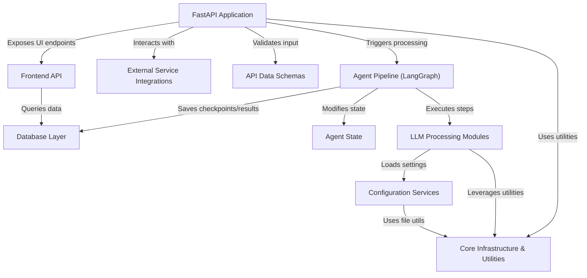

# Tutorial: 7thgear-ai-service-mle

This project is an AI service built with FastAPI and LangGraph.
Its main purpose is to process raw transcript text, using **Large Language Models (LLMs)** to extract structured insights like *agendas, key points, action items, and sentiments*.
It stores the processing results in a **database** and exposes APIs for other systems to initiate summarization jobs (potentially fetching transcripts from **external services** like S3) and retrieve the generated summaries and analysis.

**Source Repository:** [None](None)

## Chapters

1. [FastAPI Application
](01_fastapi_application_.md)
2. [API Data Schemas
](02_api_data_schemas_.md)
3. [External Service Integrations
](03_external_service_integrations_.md)
4. [Agent Pipeline (LangGraph)
](04_agent_pipeline__langgraph__.md)
5. [Agent State
](05_agent_state_.md)
6. [Configuration Services
](06_configuration_services_.md)
7. [LLM Processing Modules
](07_llm_processing_modules_.md)
8. [Database Layer
](08_database_layer_.md)
9. [Frontend API
](09_frontend_api_.md)
10. [Core Infrastructure & Utilities
](10_core_infrastructure___utilities_.md)

---

Generated by [AI Codebase Knowledge Builder](https://github.com/The-Pocket/Tutorial-Codebase-Knowledge)